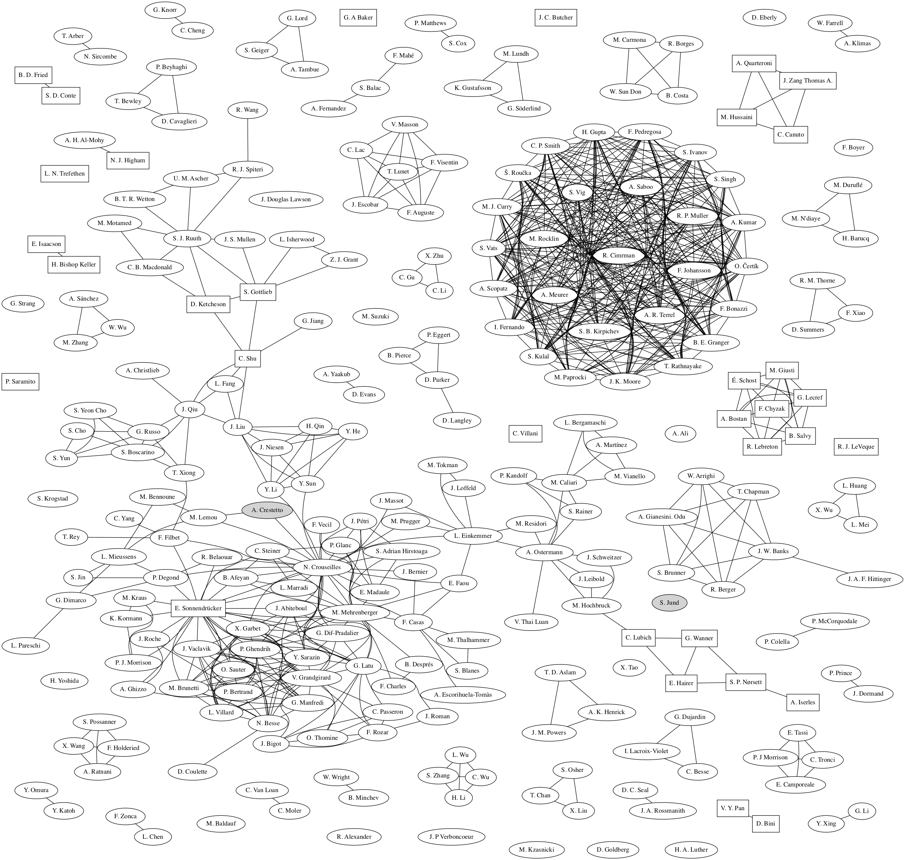

# Bibliography

- [[Fried:1961](+../../miMaS/bibliography/pdf/1961-Fried.pdf)] **The Plasma Dispersion Function; the Hilbert transform of the Gaussian** (*1961*)
	B. D. Fried, S. D. Conte
	 
- [[Lawson:1967a](https://doi.org/10.1137/0704033)] **Generalized Runge-Kutta Processes for Stable Systems with Large Lipschitz Constants** (*1967*)
	J. Douglas Lawson
	*SIAM Journal on Numerical Analysis*
- [[Lawson:1967](,../../miMaS/bibliography/pdf/1967-Lawson.pdf)] **An Order Six Runge-Kutta Process with Extended Region of Stability** (*1967*)
	J. Douglas Lawson
	*Journal on Numerical Analysis*
- [[Strang:1968](https://doi.org/10.1137/0705041)] **On the Construction and Comparison of Difference Schemes** (*1968*)
	G. Strang
	*SIAM Journal on Numerical Analysis*
- [[Luther:1968](,../../miMaS/bibliography/pdf/1968-Luther.pdf)] **An Explicit Sixth-Order Runge-Kutta Formula** (*1968*)
	H. A. Luther
	*Mathematics of Computation*
- [[Alexander:1976](/../../miMaS/bibliography/pdf/1976-Alexander.pdf)] **Diagonally Implicit Runge–Kutta Methods for Stiff O.D.E.'s** (*1976*)
	R. Alexander
	*Journal on Numerical Analysis*
- [[Dormand:1978](-../../miMaS/bibliography/pdf/1978-Dormand.pdf)] **New Runge-Kutta algorithms for numerical simulation in dynamical astronomy** (*1978*)
	J. Dormand, P. Prince
	*Celestial mechanics*
- [[Dormand:1980](-../../miMaS/bibliography/pdf/1980-Dormand.pdf)] **A family of embedded Runge-Kutta formulae** (*1980*)
	J. Dormand, P. Prince
	*Journal of Computational and Applied Mathematics*
- [[Suzuki:1990](http://www.sciencedirect.com/science/article/pii/037596019090962N)] **Fractal decomposition of exponential operators with applications to many-body theories and Monte Carlo simulations** (*1990*)
	M. Suzuki
	*Physics Letters A*
- [[Yoshida:1990](-../../miMaS/bibliography/pdf/1990-Yoshida.pdf)] **Construction of higher order symplectic integrators** (*1990*)
	H. Yoshida
	*Physics Letters A*
- [[Iserles:1991](-../../miMaS/bibliography/pdf/1991-Iserles.pdf)] **Order Stars** (*1991*)
	A. Iserles, S. P. Nørsett
	 
- [[Goldberg:1991](.../../miMaS/bibliography/pdf/1991-Goldberg.pdf)] **What Every Computer Scientist Should Know About Floating-Point Arithmetic** (*1991*)
	D. Goldberg
	*ACM Computing Surveys*
- [[Liu:1994](pdf/1994-Liu.pdf)] **Weighted Essentially Non-oscillatory Schemes** (*1994*)
	X. Liu, S. Osher, T. Chan
	*Journal of Computational Physics*
- [[Hairer:1996](,../../miMaS/bibliography/pdf/1996-Hairer.pdf)] **Solving Ordinary Differential Equations II: Stiff and Differential-Algebraic Problems (Springer Series in Computational Mathematics)** (*1996*)
	E. Hairer, G. Wanner
	 
- [[Jiang:1996](+../../miMaS/bibliography/pdf/1996-Jiang.pdf)] **Efficient Implementation of Weighted ENO Schemes** (*1996*)
	G. Jiang, C. Shu
	*Journal of Computational Physics*
- [[Shu:1997]()../../miMaS/bibliography/pdf/1997-Shu.pdf)] **Essentially Non-Oscillatory and Weighted Essentially Non-Oscillatory Schemes for Hyperbolic Conservation Laws** (*1997*)
	C. Shu
	 
- [[Xiao:1998](*../../miMaS/bibliography/pdf/1998-Xiao.pdf)] **Instability of electromagnetic R-mode waves in a relativistic plasma** (*1998*)
	F. Xiao, R. M. Thorne, D. Summers
	*Physics of Plasmas*
- [[Barth:1999](+../../miMaS/bibliography/pdf/1999-Barth.pdf)] **High-order methods for computational physics** (*1999*)
	
	 
- [[Shu:1999](+../../miMaS/bibliography/pdf/1999-Barth.pdf)] **High Order ENO and WENO Schemes for Computational Fluid Dynamics** (*1999*)
	C. Shu
	 
- [[Villani:2001](-../../miMaS/bibliography/pdf/2001-Villani.pdf)] **A review of mathematical topics in collisional kinetic theory** (*2001*)
	C. Villani
	 
- [[Shu:2001]()../../miMaS/bibliography/pdf/2001-Shu.pdf)] **A Survey of Strong Stability Preserving High Order Time Discretizations** (*2001*)
	C. Shu
	 
- [[Spiteri:2002](-../../miMaS/bibliography/pdf/2002-Spiteri.pdf)] **A New Class of Optimal High-Order Strong-Stability-Preserving Time Discretization Methods** (*2002*)
	R. J. Spiteri, S. J. Ruuth
	*Journal on Numerical Analysis*
- [[Shu:2003]()../../miMaS/bibliography/pdf/2003-Shu.pdf)] **High Order Finite Difference and Finite Volume WENO Schemes and Discontinuous Galerkin Methods for CFD** (*2003*)
	C. Shu
	*International Journal of Computational Fluid Dynamics*
- [[Eberly:2003](,../../miMaS/bibliography/pdf/2003-Eberly.pdf)] **Stability Analysis for Systems of Differential Equations** (*2003*)
	D. Eberly
	 
- [[LeVeque:2004](-../../miMaS/bibliography/pdf/2004-LeVeque.pdf)] **Finite-Volume Methods for Hyperbolic Problems** (*2004*)
	R. J. LeVeque
	 
- [[Hochbruck:2005](/../../miMaS/bibliography/pdf/2005-Hochbruck.pdf)] **Explicit Exponential Runge–Kutta Methods for Semilinear Parabolic Problems** (*2005*)
	M. Hochbruck, A. Ostermann
	*SIAM Journal on Numerical Analysis*
- [[Henrick:2005](-../../miMaS/bibliography/pdf/2005-Henrick.pdf)] **Mapped weighted essentially non-oscillatory schemes: Achieving optimal order near critical points** (*2005*)
	A. K. Henrick, T. D. Aslam, J. M. Powers
	*Journal of Computational Physics*
- [[Degond:2005](,../../miMaS/bibliography/pdf/2005-Degond.pdf)] **A smooth transition model between kinetic and hydrodynamic equations** (*2005*)
	P. Degond, S. Jin, L. Mieussens
	*Journal of Computational Physics*
- [[Hairer:2006]()] **Geometric numerical integration : structure-preserving algorithms for ordinary differential equations** (*2006*)
	E. Hairer
	 
- [[Gottlieb:2006](.../../miMaS/bibliography/pdf/2006-Gottlieb.pdf)] **A Fifth Order Flux Implicit WENO Method** (*2006*)
	S. Gottlieb, J. S. Mullen, S. J. Ruuth
	*Journal of Scientific Computing*
- [[Katoh:2007](https://agupubs.onlinelibrary.wiley.com/doi/abs/10.1029/2006GL028594)] **Computer simulation of chorus wave generation in the Earth's inner magnetosphere** (*2007*)
	Y. Katoh, Y. Omura
	*Geophysical Research Letters*
- [[Wang:2007](*../../miMaS/bibliography/pdf/2007-Wang.pdf)] **Linear instability of the fifth-order WENO method** (*2007*)
	R. Wang, R. J. Spiteri
	*Journal on Numerical Analysis*
- [[Jund:2007](*../../miMaS/bibliography/pdf/2007-Jund.pdf)] **Méthodes d'éléments finis d'ordre élevé pour la simulation numérique de la propagation d'ondes** (*2007*)
	S. Jund
	 
- [[LeVeque:2007](-../../miMaS/bibliography/pdf/2007-LeVeque.pdf)] **Finite Difference Methods for Ordinary and Partial Differential Equations** (*2007*)
	R. J. LeVeque
	 
- [[Baldauf:2008](-../../miMaS/bibliography/pdf/2008-Baldauf.pdf)] **Stability Analysis for linear discretisations of the advection equation with Runge-Kutta time integration** (*2008*)
	M. Baldauf
	*Journal of Computational Physics*
- [[Butcher:2008](-../../miMaS/bibliography/pdf/2008-Butcher.pdf)] **Numerical Methods for Ordinary Differential Equations** (*2008*)
	J. C. Butcher
	 
- [[Borges:2008](,../../miMaS/bibliography/pdf/2008-Borges.pdf)] **An improved weighted essentially non-oscillatory scheme for hyperbolic conservation laws** (*2008*)
	R. Borges, M. Carmona, B. Costa, W. Sun Don
	*Journal of Computational Physics*
- [[Bennoune:2008](.../../miMaS/bibliography/pdf/2008-Bennoune.pdf)] **Uniformly stable numerical schemes for the Boltzmann equation preserving the compressible Navier-Stokes asymptotics** (*2008*)
	M. Bennoune, M. Lemou, L. Mieussens
	*Journal of Computational Physics*
- [[Qiu:2008]()../../miMaS/bibliography/pdf/2008-Qiu.pdf)] **A WENO algorithm for the growth of ionized regions at the reionization epoch** (*2008*)
	J. Qiu, C. Shu, J. Liu, L. Fang
	*New Astronomy*
- [[Despres:2009](-../../miMaS/bibliography/pdf/2009-Despres.pdf)] **Uniform asymptotic stability of Strang's explicit compact schemes for linear advection** (*2009*)
	B. Després
	*Journal on Numerical Analysis*
- [[Tronci:2010](https://doi.org/10.1088%2F1751-8113%2F43%2F37%2F375501)] **Hamiltonian approach to hybrid plasma models** (*2010*)
	C. Tronci
	*Journal of Physics A: Mathematical and Theoretical*
- [[Qiu:2010]()../../miMaS/bibliography/pdf/2010-Qiu.pdf)] **A conservative high order semi-Lagrangian WENO method for the Vlasov equation** (*2010*)
	J. Qiu, A. Christlieb
	*Journal of Computational Physics*
- [[Hochbruck:2010](/../../miMaS/bibliography/pdf/2010-Hochbruck.pdf)] **Exponential integrators** (*2010*)
	M. Hochbruck, A. Ostermann
	*Acta Numerica*
- [[Motamed:2010](0../../miMaS/bibliography/pdf/2010-Motamed(1).pdf)] **On the Linear Stability of the Fifth-Order WENO Discretization** (*2010*)
	M. Motamed, C. B. Macdonald, S. J. Ruuth
	*Journal of Scientific Computing*
- [[Degond:2010](/../../miMaS/bibliography/pdf/2010-Degond(2).pdf)] **A multiscale kinetic-fluid solver with dynamic localization of kinetic effects** (*2010*)
	P. Degond, G. Dimarco, L. Mieussens
	*Journal of Computational Physics*
- [[Banks:2010](+../../miMaS/bibliography/pdf/2010-Banks.pdf)] **A New Class of Non-Linear, Finite-Volume Methods for Vlasov Simulation** (*2010*)
	J. W. Banks, J. A. F. Hittinger
	*IEEE Transactions on Plasma Science*
- [[Qiu:2011]()../../miMaS/bibliography/pdf/2011-Qiu.pdf)] **Conservative high order semi-Lagrangian finite difference WENO methods for advection in incompressible flow** (*2011*)
	J. Qiu, C. Shu
	*Journal of Computational Physics*
- [[Wu:2011]((../../miMaS/bibliography/pdf/2011-Wu.pdf)] **An Implicit 2-D Shallow Water Flow Model on Unstructured Quadtree Rectangular Mesh** (*2011*)
	W. Wu, A. Sánchez, M. Zhang
	*Journal of Coastral Research*
- [[Dimarco:2011](-../../miMaS/bibliography/pdf/2011-Dimarco.pdf)] **Exponential Runge-Kutta methods for stiff kinetic equations** (*2011*)
	G. Dimarco, L. Pareschi
	*Journal on Numerical Analysis*
- [[McCorquodale:2011](2../../miMaS/bibliography/pdf/2011-McCorquodale.pdf)] **A high-order finite-volume method for hyperbolic conservation laws on locally-refined grids** (*2011*)
	P. McCorquodale, P. Colella
	*Communications in Applied Mathematics and Computational Science*
- [[Morrison:2012](https://doi.org/10.1063/1.4774063)] **A general theory for gauge-free lifting** (*2012*)
	P. J. Morrison
	*Physics of Plasmas*
- [[Charles:2012](-../../miMaS/bibliography/pdf/2012-Charles.pdf)] **nhanced Convergence Estimates for Semi-Lagrangian Schemes Application to the Vlasov–Poisson Equation** (*2012*)
	F. Charles, B. Després, M. Mehrenberger
	*Journal on Numerical Analysis*
- [[Dimarco:2012](-../../miMaS/bibliography/pdf/2012-Dimarco.pdf)] **High order asymptotic-preserving schemes for the Boltzmann equation** (*2012*)
	G. Dimarco, L. Pareschi
	*Comptes Rendus Mathematique*
- [[Crestetto:2012a](2../../miMaS/bibliography/pdf/2012-Crestetto(a).pdf)] **Optimisation de méthodes numériques pour la physique des plasmas. Application aux faisceaux de particules chargées** (*2012*)
	A. Crestetto
	 
- [[Crestetto:2012b](2../../miMaS/bibliography/pdf/2012-Crestetto(b).pdf)] **Kinetic/Fluid Micro-Macro Numerical Schemes for Vlasov-Poisson-BGK Equation Using Particles** (*2012*)
	A. Crestetto, N. Crouseilles, M. Lemou
	*Kinetic and Related Models*
- [[Charles:2013](https://doi.org/10.1137/110851511)] **Enhanced Convergence Estimates for Semi-Lagrangian Schemes Application to the Vlasov–Poisson Equation** (*2013*)
	F. Charles, B. Després, M. Mehrenberger
	*SIAM Journal on Numerical Analysis*
- [[Balac:2013b](.../../miMaS/bibliography/pdf/2013-Balac(b).pdf)] **Mathematical analysis of adaptive step-size techniques when solving the nonlinear Schrödinger equation for simulating light-wave propagation in optical fibers** (*2013*)
	S. Balac, A. Fernandez
	 
- [[Balac:2013a](.../../miMaS/bibliography/pdf/2013-Balac(a).pdf)] **Embedded Runge-Kutta scheme for step-size control in the interaction picture method** (*2013*)
	S. Balac, F. Mahé
	*Computer Physics Communications*
- [[Ketcheson:2013](/../../miMaS/bibliography/pdf/2013-Ketcheson.pdf)] **Spatially partitioned embedded Runge-Kutta methods** (*2013*)
	D. Ketcheson, C. B. Macdonald, S. J. Ruuth
	*SIAM Journal on Numerical Analysis*
- [[Filbet:2013](,../../miMaS/bibliography/pdf/2013-Filbet.pdf)] **A rescaling velocity method for dissipative kinetic equations. Applications to granular media** (*2013*)
	F. Filbet, T. Rey
	*Journal of Computational Physics*
- [[Dimarco:2013](-../../miMaS/bibliography/pdf/2013-Dimarco.pdf)] **Asymptotic preserving implicit-explicit Runge-Kutta methods for non linear kinetic equations** (*2013*)
	G. Dimarco, L. Pareschi
	*Journal on Numerical Analysis*
- [[Tronci:2014](https://doi.org/10.1088%2F0741-3335%2F56%2F9%2F095008)] **Hybrid Vlasov-MHD models: Hamiltonian vs. non-Hamiltonian** (*2014*)
	C. Tronci, E. Tassi, E. Camporeale, P. J Morrison
	*Plasma Physics and Controlled Fusion*
- [[Yang:2014](*../../miMaS/bibliography/pdf/2014-Yang.pdf)] **Conservative and non-conservative methods based on Hermite weighted essentially-non-oscillatory reconstruction for Vlasov equations** (*2014*)
	C. Yang, F. Filbet
	*Journal of Computational Physics*
- [[Tao:2014]()../../miMaS/bibliography/pdf/2014-Tao.pdf)] **A numerical study of chorus generation and the related variation of wave intensity using the DAWN code** (*2014*)
	X. Tao
	*Journal of Geophysical Research: Space Physics*
- [[Filbet:2014](/../../miMaS/bibliography/pdf/2014-Filbet(1).pdf)] **A hierachy of hybrid numerical methods for multi-scale kinetic equations** (*2014*)
	F. Filbet, T. Rey
	*Journal of Scientific Computing*
- [[Boyer:2014](+../../miMaS/bibliography/pdf/2014-Boyer.pdf)] **Aspects théoriques et numériques de l'équation de transport** (*2014*)
	F. Boyer
	 
- [[Crouseilles:2015](https://doi.org/10.1016/j.jcp.2014.11.029)] **Hamiltonian splitting for the Vlasov-Maxwell equations** (*2015*)
	N. Crouseilles, L. Einkemmer, E. Faou
	*Journal of Computational Physics*
- [[Ketcheson:2015](https://nodepy.readthedocs.io/en/latest/)] **NodePy (Numerical ODEs in Python) softwate version 0.6** (*2015*)
	D. Ketcheson
	 
- [[Sonnendrucker:2015](3../../miMaS/bibliography/pdf/2015-Sonnendrucker.pdf)] **Numerical Methods for the Vlasov-Maxwell equations** (*2015*)
	E. Sonnendrücker
	 
- [[Chen:2016](https://doi.org/10.1103/RevModPhys.88.015008)] **Physics of Alfvén waves and energetic particles in burning plasmas** (*2016*)
	L. Chen, F. Zonca
	*Rev. Mod. Phys.*
- [[Li:2016]((../../miMaS/bibliography/pdf/2016-Li.pdf)] **High order finite volume WENO schemes for Euler equations under gravitational fields** (*2016*)
	G. Li, Y. Xing
	*Journal of Computational Physics*
- [[Morrison:2017](https://doi.org/10.1063/1.4982054)] **Structure and structure-preserving algorithms for plasma physics** (*2017*)
	P. J. Morrison
	*Physics of Plasmas*
- [[Kraus:2017](https://doi.org/10.1017/S002237781700040X)] **GEMPIC: geometric electromagnetic particle-in-cell methods** (*2017*)
	M. Kraus, K. Kormann, P. J. Morrison, E. Sonnendrücker
	*Journal of Plasma Physics*
- [[Casas:2017](https://doi.org/10.1007/s00211-016-0816-z)] **High-order Hamiltonian splitting for Vlasov-Poisson equations** (*2017*)
	F. Casas, N. Crouseilles, E. Faou, M. Mehrenberger
	*Numerische Mathematik*
- [[Besse:2017](+../../miMaS/bibliography/pdf/2017-Besse.pdf)] **High order exponential integrators for nonlinear Schrödinger equations with application to rotating Bose-Einstein condensates** (*2017*)
	C. Besse, G. Dujardin, I. Lacroix-Violet
	*SIAM Journal on Numerical Analysis*
- [[Meurer:2017](https://doi.org/10.7717/peerj-cs.103)] **SymPy: symbolic computing in Python** (*2017*)
	A. Meurer, C. P. Smith, M. Paprocki, O. Čertík, S. B. Kirpichev, M. Rocklin, A. Kumar, S. Ivanov, J. K. Moore, S. Singh, T. Rathnayake, S. Vig, B. E. Granger, R. P. Muller, F. Bonazzi, H. Gupta, S. Vats, F. Johansson, F. Pedregosa, M. J. Curry, A. R. Terrel, Š. Roučka, A. Saboo, I. Fernando, S. Kulal, R. Cimrman, A. Scopatz
	*PeerJ Computer Science*
- [[Lunet:2017](+../../miMaS/bibliography/pdf/2017-Lunet.pdf)] **Combination of WENO and Explicit Runge–Kutta Methods for Wind Transport in the Meso-NH Model** (*2017*)
	T. Lunet, C. Lac, F. Auguste, F. Visentin, V. Masson, J. Escobar
	*Monthly Weather Review*
- [[Bostan:2017](,../../miMaS/bibliography/pdf/2017-Bostan.pdf)] **Algorithmes Efficaces en Calcul Formel** (*2017*)
	A. Bostan, F. Chyzak, M. Giusti, R. Lebreton, G. Lecref, B. Salvy, É. Schost
	 
- [[Kzasnicki:2017](/../../miMaS/bibliography/pdf/2017-Kzasnicki.pdf)] **Ten equivalent definitions of the fractional Laplace operator** (*2017*)
	M. Kzasnicki
	*Fractional Calculus & Applied Analysis*
- [[Crouseilles:2018](1../../miMaS/bibliography/pdf/2018-Crouseilles.pdf)] **An exponential integrator for the drift-kinetic model** (*2018*)
	N. Crouseilles, L. Einkemmer, M. Prugger
	*Computer Physics Communications*
- [[Ali:2018]()../../miMaS/bibliography/pdf/2018-Ali.pdf)] **Hybrid algorithm for the Vlasov-Poisson system** (*2018*)
	A. Ali
	 
- [[Filbet:2018](/../../miMaS/bibliography/pdf/2018-Filbet(1).pdf)] **A hybrid discontinuous Galrkin scheme for mulit-scale kinetic equations** (*2018*)
	F. Filbet, T. Xiong
	*Journal of Computational Physics*
- [[Holderied:2018](/../../miMaS/bibliography/pdf/2018-Holderied.pdf)] **Electron Hybrid model for R/L-waves in cold plasmas** (*2018*)
	F. Holderied
	 
- [[Isherwood:2018](2../../miMaS/bibliography/pdf/2018-Isherwood(1).pdf)] **Strong Stability Preserving Integrating Factor Runge-Kutta Methods** (*2018*)
	L. Isherwood, Z. J. Grant, S. Gottlieb
	*SIAM Journal on Numerical Analysis*
- [[Crestetto:2018](/../../miMaS/bibliography/pdf/2018-Crestetto.pdf)] **A particle micro-macro decomposition based numercial scheme for collisional kinetic equations in the diffusion scaling** (*2018*)
	A. Crestetto, N. Crouseilles, M. Lemou
	*Communications in Mathematical Sciences*
- [[Crouseilles:2019b](4../../miMaS/bibliography/pdf/2019-Crouseilles(b).pdf)] **Exponential methods for solving hyperbolic problems with application to kinetic equations** (*2019*)
	N. Crouseilles, L. Einkemmer, J. Massot
	 
- [[Blanes:2019](,../../miMaS/bibliography/pdf/2019-Blanes.pdf)] **Splitting and composition methods with embedded error estimators** (*2019*)
	S. Blanes, F. Casas, M. Thalhammer
	*Applied Numerical Mathematics*
- [[Crouseilles:2019a](4../../miMaS/bibliography/pdf/2019-Crouseilles(a).pdf)] **Some few examples of exponential integrators and their stability** (*2019*)
	N. Crouseilles
	 
- [[Holderied:2019](/../../miMaS/bibliography/pdf/2019-Holderied.pdf)] **Investigation of Finite Element Methods for a 4D Hyrbid Plasma Model** (*2019*)
	F. Holderied
	 
- [[Banks:2019](.../../miMaS/bibliography/pdf/2019-Banks(1).pdf)] **High order accurate conservative finite difference methods for Vlasov equations in 2D+2V** (*2019*)
	J. W. Banks, A. Gianesini. Odu, R. Berger, T. Chapman, W. Arrighi, S. Brunner
	*SIAM Journal on Scientific Computing*
- [[Casas:2020](https://www.mdpi.com/2227-7390/8/4/533)] **Composition Methods for Dynamical Systems Separable into Three Parts** (*2020*)
	F. Casas, A. Escorihuela-Tomàs
	*Mathematics*
- [[Holderied:2020](2../../miMaS/bibliography/pdf/2020-Holderied(1).pdf)] **Structure-preserving vs. standard particle-in-cell methods: The case of an electron hybrid model** (*2020*)
	F. Holderied, S. Possanner, A. Ratnani, X. Wang
	*Journal of Computational Physics*
- [[Li:2020](https://doi.org/10.1016/j.jcp.2019.109172)] **Numerical simulations of Vlasov-Maxwell equations for laser plasmas based on Poisson structure** (*2020*)
	Y. Li, N. Crouseilles, Y. Sun
	*Journal of Computational Physics*
- [[Crouseilles:2020](1../../miMaS/bibliography/pdf/2020-Crouseilles.pdf)] **Poisson bracket for one electron hybrid model** (*2020*)
	N. Crouseilles
	 

# Links

