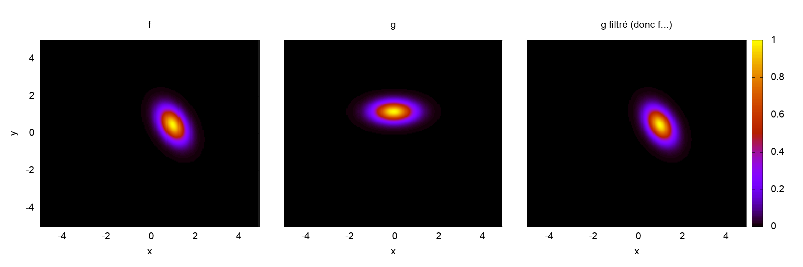
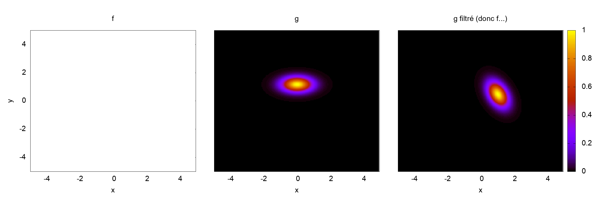

# 2020-09-30

## Nouvelles du filtrage

Le *toy-model* a été implémenté, et pour effectuer la rotation de fin : $f(t,v) = g(t,e^{-tJ}v)$ Nicolas m'a conseillé le [splitting en 3 étapes de Joackim](http://people.rennes.inria.fr/Nicolas.Crouseilles/hal_BCC.pdf). Effectuer une rotation de $t$ revient à calculer la solution $h$ de l'équation $\partial_t h + Jv\cdot\partial_v h=0$, $h(0)=g(t)$ (dans notre cas).

$$
  \begin{aligned}
    \phi_1 &= \begin{cases}
      \partial_t h + v_2\partial_{v_1}h = 0
    \end{cases} \\
    \phi_2 &= \begin{cases}
      \partial_t h - v_1\partial_{v_2}h = 0
    \end{cases}\\
    \phi_3 &= \begin{cases}
      \partial_t h + v_2\partial_{v_1}h = 0
    \end{cases}
  \end{aligned}
$$
et on a $f(t) = \phi_3^{[\tan(t/2)]}\circ\phi_2^{[\sin(t)]}\circ\phi_1^{[\tan(t/2)]}(g(t))$. Chaque système est résolu par une méthode de Lagrange d'ordre 5.

On effectue une simulation du *toy-model* avec les paramètres numériques suivants :

* $N_x=N_y=200$
* $T_f = 20$
* $\Omega = [-5,5]\times [-5,5]$
* $f(t=0,x,y) = \exp\left( -\frac{x^2}{0.75} -\frac{(y-1)^2}{0.25} \right)$

Une première simulation sera effectuée sous la condition CFL de l'équation sur $f$, ce qui nous donne :

$$\Delta t \leq \sigma\frac{\Delta x}{\left\|E+Jv\right\|_1} \approx 0.00637255$$

et une seconde sous la condition CFL de l'équation sur $g$ :

$$
  \Delta t \leq \sigma\frac{\Delta x}{\left\|E\right\|_1} \approx 0.325
$$

Dans le cadre de WENO-RK(3,3) $\sigma \approx 1.3$.

  

  

La solution calculée sur $f$ dans le cas où $\Delta t = 0.325$ ne donne que des `nan`, car on est complètement hors CFL, la solution sur $g$ reste *bonne* en norme de l'oeil.

> Par contre... la simulation `hybrid1dx3dv_lawson.cc` explose toujours alors que je semble être largement sous CFL. Actuellement tourne un *run* avec $B_0=0$. Les simulations de jeudi dernier qui concordaient bien entre la méthode de Lawson et la méthode de *splitting* étaient sur un maillage grossier, sur un maillage plus fin je semble toujours hors CFL alors que $\Delta t = 5\cdot 10^{-3}$.

> Est-ce que implémenter directement le filtrage pour le modèle hybride avec la méthode de Lawson ne permettrait pas de résoudre ce problème de CFL ?

## Filtrage du hybride 1dz-3dv

J'ai lancé une simulation avec $B_0 = 0$ pour vérifier qu'il n'y avait pas d'autres erreurs dans le code de Lawson, et comparer cela avec la méthode de *splitting*, cela tourne très bien sans explosé à cause d'une contrainte de CFL. Donc d'après Nicolas, puisque de toute façon on voulait effectuer ce filtrage, je passe à l'implémentation de filtrage sans que la méthode de Lawson ne tourne (ou plus exactement sans comprendre d'où vient ce problème de CFL).

Je reprends les calculs de Nicolas, on pose $g(t,z,w,v_z) = f(t,z,e^{-tB_0J}v,v_z)$ pour obtenir l'équation sur $g$ qui est :

$$
  \partial_t g + v_z\partial_z g - e^{-tB_0J}E\cdot\nabla_w g - \mathcal{B}g = 0
$$

avec $\mathcal{B}g = (\textrm{v}\times B)\cdot\nabla_\textrm{v}f$ ($\textrm{v} = (v_x,v_y,v_z)^T$). J'obtiens finalement, après calcul :

$$
  \partial_t g = \begin{pmatrix}
    -v_z \\
     E_x\cos(B_0t) + E_y\sin(B_0t) + v_zB_x\sin(B_0t) - v_zB_y\cos(B_0t) \\
    -E_x\sin(B_0t) + E_y\cos(B_0t) + v_zB_x\cos(B_0t) + v_zB_y\sin(B_0t) \\
    -B_x\left( w_1\sin(B_0t) + w_2\cos(B_0t) \right) + B_y\left( w_1\cos(B_0t) - w_2\sin(B_0t) \right)
  \end{pmatrix}
  \cdot
  \begin{pmatrix}
    \partial_{z} \\
    \partial_{w_1} \\
    \partial_{w_2} \\
    \partial_{v_z} \\
  \end{pmatrix}
$$

### Modif à faire dans le code

On a toujours une équation du type : $\partial_t u = -v_z\partial_z u + \texttt{velocity\_v1}\partial_{v_1} u + \texttt{velocity\_v2}\partial_{v_2} u + \texttt{velocity\_vz}\partial_{v_z} u$, donc en reprenant le pseudo-code du [7 septembre](#section-14), cela revient à simplement modifier les valeurs des variables `velocity_vi`.

> **Attention :** les `velocity_vi` dépendent maintenant du temps, il est donc important de prendre en compte les pas de temps de chaque étage dans la méthode Runge-Kutta.

L'autre modification à effectuer est dans le calcul des flux $\int v_xf\,\mathrm{d}v$ et $\int v_yf\,\mathrm{d}v$ qui deviennent respectivement $\int (w_1\cos(B_0t) - w_2\sin(B_0t))g\mathrm{d}w\mathrm{d}v_z$ et $\int (w_1\sin(B_0t) + w_2\cos(B_0t))g\mathrm{d}w\mathrm{d}v_z$. Ceux-ci dépendent également du temps.

