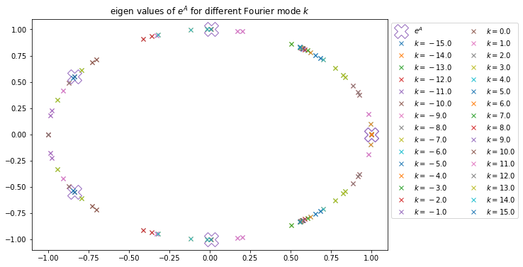
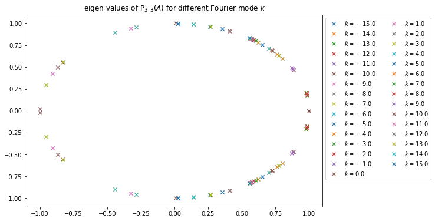
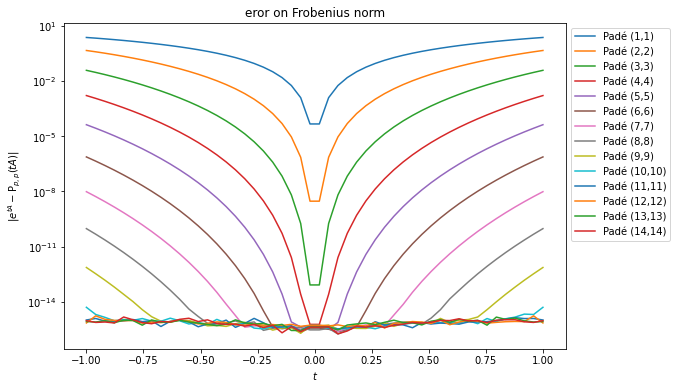
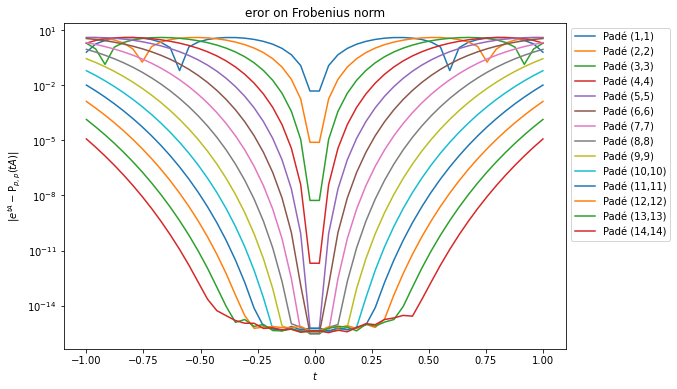
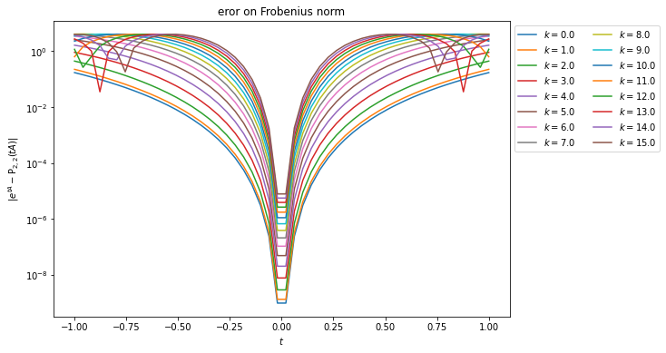

# 2021-04-17

## Grands principes de Padé-Lawson-Runge-Kutta

On s'intéresse à la résolution d'un problème du type :
$$
  \dot{u} = Lu + N(u)
$$
Pour cela on se propose d'utiliser une méthode de Lawson induite par une méthode de type Runge-Kutta RK($s$,$n$), ici on se concentrera sur une méthode RK(4,4) qui forme les premiers étages de la méthode à pas de temps adaptatif DP4(3) :

$$
  \begin{aligned}
    u^{(1)} & = e^{\frac{\Delta t}{2}L}u^n + \frac{1}{2}\Delta t e^{\frac{\Delta t}{2}L}N(u^n) \\
    u^{(2)} & = e^{\frac{\Delta t}{2}L}u^n + \frac{1}{2}\Delta t e^{\frac{\Delta t}{2}L}N(u^{(1)}) \\
    u^{(3)} & = e^{\Delta t L}u^n + \Delta t e^{\frac{\Delta t}{2}L} N(u^{(2)}) \\
    u^{n+1} & = -\frac{1}{3}e^{\Delta t L}u^n + \frac{1}{3}e^{\frac{\Delta t}{2}L}u^{(1)} + \frac{2}{3}e^{\frac{\Delta t}{2}L}u^{(2)} + \frac{1}{3}u^{(3)} + \frac{1}{6}\Delta t N(u^{(3)}) \\
  \end{aligned}
$$

Nous souhaitons utiliser cette méthode dans un contexte où le calcul de $e^{\alpha \Delta t L}$ est compliqué formellement (*i.e.* avec `sympy`), nous nous proposons de réécrire ce schéma en substituant la fonction $M\mapsto e^{M}$ par $M\mapsto \mathrm{P}_{p,q}(M)$ pour l'approximant de Padé d'ordre $(p,q)$ de $e^{M}$.

> Il est a noter que cette étape, d'un point de vue informatique, signifie simplement que l'on propose une autre implémentation de la fonction `exp`.

Le schéma devient (simple réécriture) :
$$
  \begin{aligned}
    u^{(1)} & = \mathrm{P}_{p,q}\left(\frac{\Delta t}{2}L\right)u^n + \frac{1}{2}\Delta t \mathrm{P}_{p,q}\left(\frac{\Delta t}{2}L\right)N(u^n) \\
    u^{(2)} & = \mathrm{P}_{p,q}\left(\frac{\Delta t}{2}L\right)u^n + \frac{1}{2}\Delta t \mathrm{P}_{p,q}\left(\frac{\Delta t}{2}L\right)N(u^{(1)}) \\
    u^{(3)} & = \mathrm{P}_{p,q}\left(\Delta tL\right)u^n + \Delta t \mathrm{P}_{p,q}\left(\frac{\Delta t}{2}L\right) N(u^{(2)}) \\
    u^{n+1} & = -\frac{1}{3}\mathrm{P}_{p,q}\left(\Delta t L\right)u^n + \frac{1}{3}\mathrm{P}_{p,q}\left(\frac{\Delta t}{2}L\right)u^{(1)} + \frac{2}{3}\mathrm{P}_{p,q}\left(\frac{\Delta t}{2}L\right)u^{(2)} + \frac{1}{3}u^{(3)} + \frac{1}{6}\Delta t N(u^{(3)}) \\
  \end{aligned}
$$

où la fonction $\mathrm{P}_{p,q}$ est définie comme :

$$
  \begin{aligned}
    h_{p.q}(z) = \sum_{i=0}^p \frac{\frac{p!}{(p-i)!}}{\frac{(p+q)!}{(p+q-i)!}}\frac{z^i}{i!} \\
    k_{p.q}(z) = \sum_{j=0}^q (-1)^j \frac{\frac{q!}{(q-j)!}}{\frac{(p+q)!}{(p+q-j)!}} \frac{z^j}{j!} \\
    e^{z} \approx \mathrm{P}_{p,q}(z) = \frac{h_{p,q}(z)}{k_{p,q}(z)}
  \end{aligned}
$$
pour une matrice quelconque $M$, on a :
$$
  e^{M} \approx \mathrm{P}_{p,q}(M) = h_{p,q}(M)\cdot \left(k_{p,q}(M)\right)^{-1}
$$

Le calcul des $\mathrm{P}_{p,q}(\alpha\Delta t L)$ nécessite à chaque fois une inversion de matrice, ce qui a un coût numérique élevé. Une astuce consiste donc à considérer la fonction $t\mapsto\mathrm{P}(t\cdot L)$ et de l'évaluer en certaines valeurs pour $t=\alpha \Delta t$. L'inversion n'est alors effectuée qu'une seule fois (lors de la construction de la fonction $\mathrm{P}^{[L]}_{p,q}:t\mapsto\mathrm{P}_{p,q}(t\cdot L)$. L'évaluation de cette fonction en une valeur quelconque de $t$ (même un symbol comme $\Delta t$ pour construire le schéma) est quasi-immédiate.

Maintenant pour générer un code `C++` il *suffit* de convertir les expressions `sympy` ainsi obtenues en des chaînes de caractères représentant du code `C++`.

> Cette étape se fait en plusieurs petites sous-étapes qui sont simplement techniques :
>  
> * Conversion des symbols en des noms de variables `C++`, et conversion des fonctions mathématiques en des fonctions ayant pour nom leur équivalent `C++` (`sp.sin` $\mapsto$ `std::sin` par exemple)
> * Évaluation des fractions (pour être sûr de ne pas avoir de division entre entiers qui donneraient `0` en `C++` (`1/2 == 0` et `1./2==0.5` par exemple).
> * Conversion en chaînes de caractères de ces expressions `sympy` (normalement le plus gros des manipulations sur les expressions est fait).
> * Mise en forme de ces expressions dans un squelette de code (utilisation de `jinja2` qui est un moteur de *template*).
> 
> Et contrairement à ce que je m'attendais, ce sont finalement ces étapes qui prennent le plus de temps dans la génération de code, le calcul de l'approximant de Padé (ne s'effectuant qu'une seule fois) est relativement rapide.

## Étude de l'approximant de Padé pour Vlasov-Maxwell hybride linéarisé

Dans cette section on se propose d'étudier le comportement de l'approximant de Padé pour l'équation de Vlasov-Maxwell hybride linéarisé (VMHL) :

$$
  \begin{cases}
    \partial_t j_{c,x} & = \Omega_{pe}^2E_x - j_{c,y}B_0 \\
    \partial_t j_{c,y} & = \Omega_{pe}^2E_y + j_{c,x}B_0 \\
    \partial_t B_{x}   & =  \partial_zE_y \\
    \partial_t B_{y}   & = -\partial_zE_x \\
    \partial_t E_{x}   & = -\partial_zB_y - j_{c,x} + \int v_xf_h\,\mathrm{d}v \\
    \partial_t E_{y}   & =  \partial_zB_x - j_{c,y} + \int v_yf_h\,\mathrm{d}v \\
    \partial_t f_h     & = -v_z\partial_zf_h + (E_x+v_yB_0-v_zB_y)\partial_{v_x}f_h + (E_y-v_xB_0+v_zB_x)\partial_{v_y}f_h + (v_xB_y - v_yB_x)\partial_{v_z}f_h
  \end{cases}
$$

> L'opération de filtrage n'implique pas de grandes modifications dans l'implémentation, de plus celle-ci touche seulement l'équation de Vlasov sur la variable $f_h$ et le calcul des courants $j_{h,\star} = \int v_{\star}f_h\,\mathrm{d}v$, et ce que nous allons présenter ici touche très peu ces termes.

Ce système peut s'écrire sous la forme :
$$
  \dot{U} = \underbrace{\begin{pmatrix}A & 0 \\ 0 & -ikv_z \end{pmatrix}}_{L} U + N(U)
$$
Il est nécessaire dans un schéma de Lawson de calculer l'exponentielle de la partie linéaire $L$ à différents temps. La matrice $L$ est une matrice diagonale par blocs, et l'exponentielle d'une matrice diagonale est l'exponentielle des termes diagonaux, c'est-à-dire :
$$
  e^{tL} = \begin{pmatrix}e^{tA} & 0 \\ 0 & e^{-ikv_z} \end{pmatrix} 
$$
Si on souhaite utiliser un approximant de Padé, il est possible de le faire seulement pour approximer $e^{tA}$, c'est-à-dire :
$$
  e^{tL} \approx \begin{pmatrix}\mathrm{P}_{p,q}(tA) & 0 \\ 0 & e^{-ikv_z} \end{pmatrix}
$$
Ceci permet de minimiser la taille de la matrice à inverser dans le calcul de $\mathrm{P}_{p.q}(M)$, minimiser la taille des expressions à manipuler avec `sympy` (espace mémoire et temps de calcul sur les arbres d'expression), et conserver exacte l'équation sur $f_h$.

Maintenant nous nous proposons d'étudier le comportement de l'approximant de Padé, tout d'abord avec le choix de partie linéaire sans les équations de Maxwell, et ensuite avec les équations de Maxwell.

### Partie linéaire sans les équations de Maxwell

Lorsque la partie linéaire ne contient pas les équations de Maxwell, la matrice de la partie linéaire $L$ est :
$$
  L = \begin{pmatrix}
    0   & -B_0 & 0 & 0 & \Omega_{pe}^2 & 0             & 0 \\
    B_0 &  0   & 0 & 0 & 0             & \Omega_{pe}^2 & 0 \\
    0   &  0   & 0 & 0 & 0             & 0             & 0 \\
    0   &  0   & 0 & 0 & 0             & 0             & 0 \\
   -1   &  0   & 0 & 0 & 0             & 0             & 0 \\
    0   & -1   & 0 & 0 & 0             & 0             & 0 \\
    0   &  0   & 0 & 0 & 0             & 0             & -v_z\partial_z \\
  \end{pmatrix}
$$

Pour cette matrice `sympy` permet de calculer $e^{tL}$ pour tout $t$ et tout $k$ ($k$ intervenant dans la transformée de Fourier en $z$ de la dérivée spatiale dans l'équation de Vlasov). Nous allons surtout étudier, pour $B_0=1$ et $\Omega_{pe}^2=4$, la matrice *réduite* $A$, sans l'équation de Vlasov :
$$
  A = \begin{pmatrix}
    0 & -1 & 0 & 0 & 4 & 0 \\
    1 &  0 & 0 & 0 & 0 & 4 \\
    0 &  0 & 0 & 0 & 0 & 0 \\
    0 &  0 & 0 & 0 & 0 & 0 \\
   -1 &  0 & 0 & 0 & 0 & 0 \\
    0 & -1 & 0 & 0 & 0 & 0 \\
  \end{pmatrix}
$$
et regarder $e^{tA}$ pour différentes valeurs de $t$ et comparer $\mathrm{P}_{p,p}(tA)$ pour ces mêmes valeurs de $t$ et différentes valeurs de $p\in\mathbb{N}$.

Tout d'abord on regarde $e^{t A}$ :
$$
\begin{pmatrix}
0.378732187481834 \cos{\left(\frac{\sqrt{2} t \sqrt{9 - \sqrt{17}}}{2} \right)} + 0.621267812518167 \cos{\left(\frac{\sqrt{2} t \sqrt{\sqrt{17} + 9}}{2} \right)} & 0.378732187481834 \sin{\left(\frac{\sqrt{2} t \sqrt{9 - \sqrt{17}}}{2} \right)} - 0.621267812518167 \sin{\left(\frac{\sqrt{2} t \sqrt{\sqrt{17} + 9}}{2} \right)} & 0 & 0 & 0.970142500145332 \sin{\left(\frac{\sqrt{2} t \sqrt{9 - \sqrt{17}}}{2} \right)} + 0.970142500145332 \sin{\left(\frac{\sqrt{2} t \sqrt{\sqrt{17} + 9}}{2} \right)} & - 0.970142500145332 \cos{\left(\frac{\sqrt{2} t \sqrt{9 - \sqrt{17}}}{2} \right)} + 0.970142500145332 \cos{\left(\frac{\sqrt{2} t \sqrt{\sqrt{17} + 9}}{2} \right)}\\- 0.378732187481834 \sin{\left(\frac{\sqrt{2} t \sqrt{9 - \sqrt{17}}}{2} \right)} + 0.621267812518166 \sin{\left(\frac{\sqrt{2} t \sqrt{\sqrt{17} + 9}}{2} \right)} & 0.378732187481834 \cos{\left(\frac{\sqrt{2} t \sqrt{9 - \sqrt{17}}}{2} \right)} + 0.621267812518167 \cos{\left(\frac{\sqrt{2} t \sqrt{\sqrt{17} + 9}}{2} \right)} & 0 & 0 & 0.970142500145332 \cos{\left(\frac{\sqrt{2} t \sqrt{9 - \sqrt{17}}}{2} \right)} - 0.970142500145332 \cos{\left(\frac{\sqrt{2} t \sqrt{\sqrt{17} + 9}}{2} \right)} & 0.970142500145332 \sin{\left(\frac{\sqrt{2} t \sqrt{9 - \sqrt{17}}}{2} \right)} + 0.970142500145332 \sin{\left(\frac{\sqrt{2} t \sqrt{\sqrt{17} + 9}}{2} \right)}\\0 & 0 & 1.0 & 0 & 0 & 0\\0 & 0 & 0 & 1.0 & 0 & 0\\- 0.242535625036333 \sin{\left(\frac{\sqrt{2} t \sqrt{9 - \sqrt{17}}}{2} \right)} - 0.242535625036333 \sin{\left(\frac{\sqrt{2} t \sqrt{\sqrt{17} + 9}}{2} \right)} & 0.242535625036333 \cos{\left(\frac{\sqrt{2} t \sqrt{9 - \sqrt{17}}}{2} \right)} - 0.242535625036333 \cos{\left(\frac{\sqrt{2} t \sqrt{\sqrt{17} + 9}}{2} \right)} & 0 & 0 & 0.621267812518166 \cos{\left(\frac{\sqrt{2} t \sqrt{9 - \sqrt{17}}}{2} \right)} + 0.378732187481834 \cos{\left(\frac{\sqrt{2} t \sqrt{\sqrt{17} + 9}}{2} \right)} & 0.621267812518167 \sin{\left(\frac{\sqrt{2} t \sqrt{9 - \sqrt{17}}}{2} \right)} - 0.378732187481834 \sin{\left(\frac{\sqrt{2} t \sqrt{\sqrt{17} + 9}}{2} \right)}\\- 0.242535625036333 \cos{\left(\frac{\sqrt{2} t \sqrt{9 - \sqrt{17}}}{2} \right)} + 0.242535625036333 \cos{\left(\frac{\sqrt{2} t \sqrt{\sqrt{17} + 9}}{2} \right)} & - 0.242535625036333 \sin{\left(\frac{\sqrt{2} t \sqrt{9 - \sqrt{17}}}{2} \right)} - 0.242535625036333 \sin{\left(\frac{\sqrt{2} t \sqrt{\sqrt{17} + 9}}{2} \right)} & 0 & 0 & - 0.621267812518166 \sin{\left(\frac{\sqrt{2} t \sqrt{9 - \sqrt{17}}}{2} \right)} + 0.378732187481834 \sin{\left(\frac{\sqrt{2} t \sqrt{\sqrt{17} + 9}}{2} \right)} & 0.621267812518167 \cos{\left(\frac{\sqrt{2} t \sqrt{9 - \sqrt{17}}}{2} \right)} + 0.378732187481834 \cos{\left(\frac{\sqrt{2} t \sqrt{\sqrt{17} + 9}}{2} \right)}
\end{pmatrix}
$$
à comparer avec $\mathrm{P}_{3,3}(t A)$ :
$$
\begin{pmatrix}
- \frac{2 t^{2} \left(3240 t^{8} - 5985 t^{6} - 48600 t^{4} - 486000 t^{2}\right)}{5 \left(64 t^{12} + 864 t^{10} + 11124 t^{8} + 105705 t^{6} + 394200 t^{4} + 1458000 t^{2} + 3240000\right)} + \frac{\left(1 - \frac{t^{2}}{2}\right) \left(- 7200 t^{8} - 8460 t^{6} - 151200 t^{4} - 972000 t^{2} + 3240000\right)}{64 t^{12} + 864 t^{10} + 11124 t^{8} + 105705 t^{6} + 394200 t^{4} + 1458000 t^{2} + 3240000} + \frac{\left(- \frac{t^{3}}{6} + 2 t\right) \left(600 t^{9} - 10170 t^{7} - 32400 t^{5} - 189000 t^{3} - 1620000 t\right)}{64 t^{12} + 864 t^{10} + 11124 t^{8} + 105705 t^{6} + 394200 t^{4} + 1458000 t^{2} + 3240000} + \frac{\left(\frac{3 t^{3}}{40} - \frac{t}{2}\right) \left(480 t^{9} - 16200 t^{7} - 64800 t^{5} - 243000 t^{3} + 1620000 t\right)}{64 t^{12} + 864 t^{10} + 11124 t^{8} + 105705 t^{6} + 394200 t^{4} + 1458000 t^{2} + 3240000} & - \frac{2 t^{2} \left(600 t^{9} - 10170 t^{7} - 32400 t^{5} - 189000 t^{3} - 1620000 t\right)}{5 \left(64 t^{12} + 864 t^{10} + 11124 t^{8} + 105705 t^{6} + 394200 t^{4} + 1458000 t^{2} + 3240000\right)} + \frac{\left(1 - \frac{t^{2}}{2}\right) \left(- 480 t^{9} + 16200 t^{7} + 64800 t^{5} + 243000 t^{3} - 1620000 t\right)}{64 t^{12} + 864 t^{10} + 11124 t^{8} + 105705 t^{6} + 394200 t^{4} + 1458000 t^{2} + 3240000} + \frac{\left(- \frac{t^{3}}{6} + 2 t\right) \left(- 3240 t^{8} + 5985 t^{6} + 48600 t^{4} + 486000 t^{2}\right)}{64 t^{12} + 864 t^{10} + 11124 t^{8} + 105705 t^{6} + 394200 t^{4} + 1458000 t^{2} + 3240000} + \frac{\left(\frac{3 t^{3}}{40} - \frac{t}{2}\right) \left(- 7200 t^{8} - 8460 t^{6} - 151200 t^{4} - 972000 t^{2} + 3240000\right)}{64 t^{12} + 864 t^{10} + 11124 t^{8} + 105705 t^{6} + 394200 t^{4} + 1458000 t^{2} + 3240000} & 0 & 0 & - \frac{2 t^{2} \left(1080 t^{9} - 26370 t^{7} - 97200 t^{5} - 432000 t^{3}\right)}{5 \left(64 t^{12} + 864 t^{10} + 11124 t^{8} + 105705 t^{6} + 394200 t^{4} + 1458000 t^{2} + 3240000\right)} + \frac{\left(1 - \frac{t^{2}}{2}\right) \left(- 2400 t^{9} + 40680 t^{7} + 129600 t^{5} + 756000 t^{3} + 6480000 t\right)}{64 t^{12} + 864 t^{10} + 11124 t^{8} + 105705 t^{6} + 394200 t^{4} + 1458000 t^{2} + 3240000} + \frac{\left(- \frac{t^{3}}{6} + 2 t\right) \left(- 10440 t^{8} - 2475 t^{6} - 102600 t^{4} - 486000 t^{2} + 3240000\right)}{64 t^{12} + 864 t^{10} + 11124 t^{8} + 105705 t^{6} + 394200 t^{4} + 1458000 t^{2} + 3240000} + \frac{\left(\frac{3 t^{3}}{40} - \frac{t}{2}\right) \left(- 12960 t^{8} + 23940 t^{6} + 194400 t^{4} + 1944000 t^{2}\right)}{64 t^{12} + 864 t^{10} + 11124 t^{8} + 105705 t^{6} + 394200 t^{4} + 1458000 t^{2} + 3240000} & - \frac{2 t^{2} \left(- 10440 t^{8} - 2475 t^{6} - 102600 t^{4} - 486000 t^{2} + 3240000\right)}{5 \left(64 t^{12} + 864 t^{10} + 11124 t^{8} + 105705 t^{6} + 394200 t^{4} + 1458000 t^{2} + 3240000\right)} + \frac{\left(1 - \frac{t^{2}}{2}\right) \left(12960 t^{8} - 23940 t^{6} - 194400 t^{4} - 1944000 t^{2}\right)}{64 t^{12} + 864 t^{10} + 11124 t^{8} + 105705 t^{6} + 394200 t^{4} + 1458000 t^{2} + 3240000} + \frac{\left(- \frac{t^{3}}{6} + 2 t\right) \left(- 1080 t^{9} + 26370 t^{7} + 97200 t^{5} + 432000 t^{3}\right)}{64 t^{12} + 864 t^{10} + 11124 t^{8} + 105705 t^{6} + 394200 t^{4} + 1458000 t^{2} + 3240000} + \frac{\left(\frac{3 t^{3}}{40} - \frac{t}{2}\right) \left(- 2400 t^{9} + 40680 t^{7} + 129600 t^{5} + 756000 t^{3} + 6480000 t\right)}{64 t^{12} + 864 t^{10} + 11124 t^{8} + 105705 t^{6} + 394200 t^{4} + 1458000 t^{2} + 3240000}\\
\frac{2 t^{2} \left(600 t^{9} - 10170 t^{7} - 32400 t^{5} - 189000 t^{3} - 1620000 t\right)}{5 \left(64 t^{12} + 864 t^{10} + 11124 t^{8} + 105705 t^{6} + 394200 t^{4} + 1458000 t^{2} + 3240000\right)} + \frac{\left(1 - \frac{t^{2}}{2}\right) \left(480 t^{9} - 16200 t^{7} - 64800 t^{5} - 243000 t^{3} + 1620000 t\right)}{64 t^{12} + 864 t^{10} + 11124 t^{8} + 105705 t^{6} + 394200 t^{4} + 1458000 t^{2} + 3240000} + \frac{\left(- \frac{t^{3}}{6} + 2 t\right) \left(3240 t^{8} - 5985 t^{6} - 48600 t^{4} - 486000 t^{2}\right)}{64 t^{12} + 864 t^{10} + 11124 t^{8} + 105705 t^{6} + 394200 t^{4} + 1458000 t^{2} + 3240000} + \frac{\left(- \frac{3 t^{3}}{40} + \frac{t}{2}\right) \left(- 7200 t^{8} - 8460 t^{6} - 151200 t^{4} - 972000 t^{2} + 3240000\right)}{64 t^{12} + 864 t^{10} + 11124 t^{8} + 105705 t^{6} + 394200 t^{4} + 1458000 t^{2} + 3240000} & \frac{2 t^{2} \left(- 3240 t^{8} + 5985 t^{6} + 48600 t^{4} + 486000 t^{2}\right)}{5 \left(64 t^{12} + 864 t^{10} + 11124 t^{8} + 105705 t^{6} + 394200 t^{4} + 1458000 t^{2} + 3240000\right)} + \frac{\left(1 - \frac{t^{2}}{2}\right) \left(- 7200 t^{8} - 8460 t^{6} - 151200 t^{4} - 972000 t^{2} + 3240000\right)}{64 t^{12} + 864 t^{10} + 11124 t^{8} + 105705 t^{6} + 394200 t^{4} + 1458000 t^{2} + 3240000} + \frac{\left(- \frac{t^{3}}{6} + 2 t\right) \left(600 t^{9} - 10170 t^{7} - 32400 t^{5} - 189000 t^{3} - 1620000 t\right)}{64 t^{12} + 864 t^{10} + 11124 t^{8} + 105705 t^{6} + 394200 t^{4} + 1458000 t^{2} + 3240000} + \frac{\left(- \frac{3 t^{3}}{40} + \frac{t}{2}\right) \left(- 480 t^{9} + 16200 t^{7} + 64800 t^{5} + 243000 t^{3} - 1620000 t\right)}{64 t^{12} + 864 t^{10} + 11124 t^{8} + 105705 t^{6} + 394200 t^{4} + 1458000 t^{2} + 3240000} & 0 & 0 & \frac{2 t^{2} \left(- 10440 t^{8} - 2475 t^{6} - 102600 t^{4} - 486000 t^{2} + 3240000\right)}{5 \left(64 t^{12} + 864 t^{10} + 11124 t^{8} + 105705 t^{6} + 394200 t^{4} + 1458000 t^{2} + 3240000\right)} + \frac{\left(1 - \frac{t^{2}}{2}\right) \left(- 12960 t^{8} + 23940 t^{6} + 194400 t^{4} + 1944000 t^{2}\right)}{64 t^{12} + 864 t^{10} + 11124 t^{8} + 105705 t^{6} + 394200 t^{4} + 1458000 t^{2} + 3240000} + \frac{\left(- \frac{t^{3}}{6} + 2 t\right) \left(1080 t^{9} - 26370 t^{7} - 97200 t^{5} - 432000 t^{3}\right)}{64 t^{12} + 864 t^{10} + 11124 t^{8} + 105705 t^{6} + 394200 t^{4} + 1458000 t^{2} + 3240000} + \frac{\left(- \frac{3 t^{3}}{40} + \frac{t}{2}\right) \left(- 2400 t^{9} + 40680 t^{7} + 129600 t^{5} + 756000 t^{3} + 6480000 t\right)}{64 t^{12} + 864 t^{10} + 11124 t^{8} + 105705 t^{6} + 394200 t^{4} + 1458000 t^{2} + 3240000} & \frac{2 t^{2} \left(- 1080 t^{9} + 26370 t^{7} + 97200 t^{5} + 432000 t^{3}\right)}{5 \left(64 t^{12} + 864 t^{10} + 11124 t^{8} + 105705 t^{6} + 394200 t^{4} + 1458000 t^{2} + 3240000\right)} + \frac{\left(1 - \frac{t^{2}}{2}\right) \left(- 2400 t^{9} + 40680 t^{7} + 129600 t^{5} + 756000 t^{3} + 6480000 t\right)}{64 t^{12} + 864 t^{10} + 11124 t^{8} + 105705 t^{6} + 394200 t^{4} + 1458000 t^{2} + 3240000} + \frac{\left(- \frac{t^{3}}{6} + 2 t\right) \left(- 10440 t^{8} - 2475 t^{6} - 102600 t^{4} - 486000 t^{2} + 3240000\right)}{64 t^{12} + 864 t^{10} + 11124 t^{8} + 105705 t^{6} + 394200 t^{4} + 1458000 t^{2} + 3240000} + \frac{\left(- \frac{3 t^{3}}{40} + \frac{t}{2}\right) \left(12960 t^{8} - 23940 t^{6} - 194400 t^{4} - 1944000 t^{2}\right)}{64 t^{12} + 864 t^{10} + 11124 t^{8} + 105705 t^{6} + 394200 t^{4} + 1458000 t^{2} + 3240000}\\
0 & 0 & 1 & 0 & 0 & 0\\
0 & 0 & 0 & 1 & 0 & 0\\
\frac{t^{3} \left(3240 t^{8} - 5985 t^{6} - 48600 t^{4} - 486000 t^{2}\right)}{30 \left(64 t^{12} + 864 t^{10} + 11124 t^{8} + 105705 t^{6} + 394200 t^{4} + 1458000 t^{2} + 3240000\right)} + \frac{t^{2} \left(480 t^{9} - 16200 t^{7} - 64800 t^{5} - 243000 t^{3} + 1620000 t\right)}{10 \left(64 t^{12} + 864 t^{10} + 11124 t^{8} + 105705 t^{6} + 394200 t^{4} + 1458000 t^{2} + 3240000\right)} + \frac{\left(1 - \frac{2 t^{2}}{5}\right) \left(600 t^{9} - 10170 t^{7} - 32400 t^{5} - 189000 t^{3} - 1620000 t\right)}{64 t^{12} + 864 t^{10} + 11124 t^{8} + 105705 t^{6} + 394200 t^{4} + 1458000 t^{2} + 3240000} + \frac{\left(\frac{t^{3}}{24} - \frac{t}{2}\right) \left(- 7200 t^{8} - 8460 t^{6} - 151200 t^{4} - 972000 t^{2} + 3240000\right)}{64 t^{12} + 864 t^{10} + 11124 t^{8} + 105705 t^{6} + 394200 t^{4} + 1458000 t^{2} + 3240000} & \frac{t^{3} \left(600 t^{9} - 10170 t^{7} - 32400 t^{5} - 189000 t^{3} - 1620000 t\right)}{30 \left(64 t^{12} + 864 t^{10} + 11124 t^{8} + 105705 t^{6} + 394200 t^{4} + 1458000 t^{2} + 3240000\right)} + \frac{t^{2} \left(- 7200 t^{8} - 8460 t^{6} - 151200 t^{4} - 972000 t^{2} + 3240000\right)}{10 \left(64 t^{12} + 864 t^{10} + 11124 t^{8} + 105705 t^{6} + 394200 t^{4} + 1458000 t^{2} + 3240000\right)} + \frac{\left(1 - \frac{2 t^{2}}{5}\right) \left(- 3240 t^{8} + 5985 t^{6} + 48600 t^{4} + 486000 t^{2}\right)}{64 t^{12} + 864 t^{10} + 11124 t^{8} + 105705 t^{6} + 394200 t^{4} + 1458000 t^{2} + 3240000} + \frac{\left(\frac{t^{3}}{24} - \frac{t}{2}\right) \left(- 480 t^{9} + 16200 t^{7} + 64800 t^{5} + 243000 t^{3} - 1620000 t\right)}{64 t^{12} + 864 t^{10} + 11124 t^{8} + 105705 t^{6} + 394200 t^{4} + 1458000 t^{2} + 3240000} & 0 & 0 & \frac{t^{3} \left(1080 t^{9} - 26370 t^{7} - 97200 t^{5} - 432000 t^{3}\right)}{30 \left(64 t^{12} + 864 t^{10} + 11124 t^{8} + 105705 t^{6} + 394200 t^{4} + 1458000 t^{2} + 3240000\right)} + \frac{t^{2} \left(- 12960 t^{8} + 23940 t^{6} + 194400 t^{4} + 1944000 t^{2}\right)}{10 \left(64 t^{12} + 864 t^{10} + 11124 t^{8} + 105705 t^{6} + 394200 t^{4} + 1458000 t^{2} + 3240000\right)} + \frac{\left(1 - \frac{2 t^{2}}{5}\right) \left(- 10440 t^{8} - 2475 t^{6} - 102600 t^{4} - 486000 t^{2} + 3240000\right)}{64 t^{12} + 864 t^{10} + 11124 t^{8} + 105705 t^{6} + 394200 t^{4} + 1458000 t^{2} + 3240000} + \frac{\left(\frac{t^{3}}{24} - \frac{t}{2}\right) \left(- 2400 t^{9} + 40680 t^{7} + 129600 t^{5} + 756000 t^{3} + 6480000 t\right)}{64 t^{12} + 864 t^{10} + 11124 t^{8} + 105705 t^{6} + 394200 t^{4} + 1458000 t^{2} + 3240000} & \frac{t^{3} \left(- 10440 t^{8} - 2475 t^{6} - 102600 t^{4} - 486000 t^{2} + 3240000\right)}{30 \left(64 t^{12} + 864 t^{10} + 11124 t^{8} + 105705 t^{6} + 394200 t^{4} + 1458000 t^{2} + 3240000\right)} + \frac{t^{2} \left(- 2400 t^{9} + 40680 t^{7} + 129600 t^{5} + 756000 t^{3} + 6480000 t\right)}{10 \left(64 t^{12} + 864 t^{10} + 11124 t^{8} + 105705 t^{6} + 394200 t^{4} + 1458000 t^{2} + 3240000\right)} + \frac{\left(1 - \frac{2 t^{2}}{5}\right) \left(- 1080 t^{9} + 26370 t^{7} + 97200 t^{5} + 432000 t^{3}\right)}{64 t^{12} + 864 t^{10} + 11124 t^{8} + 105705 t^{6} + 394200 t^{4} + 1458000 t^{2} + 3240000} + \frac{\left(\frac{t^{3}}{24} - \frac{t}{2}\right) \left(12960 t^{8} - 23940 t^{6} - 194400 t^{4} - 1944000 t^{2}\right)}{64 t^{12} + 864 t^{10} + 11124 t^{8} + 105705 t^{6} + 394200 t^{4} + 1458000 t^{2} + 3240000}\\
- \frac{t^{3} \left(600 t^{9} - 10170 t^{7} - 32400 t^{5} - 189000 t^{3} - 1620000 t\right)}{30 \left(64 t^{12} + 864 t^{10} + 11124 t^{8} + 105705 t^{6} + 394200 t^{4} + 1458000 t^{2} + 3240000\right)} - \frac{t^{2} \left(- 7200 t^{8} - 8460 t^{6} - 151200 t^{4} - 972000 t^{2} + 3240000\right)}{10 \left(64 t^{12} + 864 t^{10} + 11124 t^{8} + 105705 t^{6} + 394200 t^{4} + 1458000 t^{2} + 3240000\right)} + \frac{\left(1 - \frac{2 t^{2}}{5}\right) \left(3240 t^{8} - 5985 t^{6} - 48600 t^{4} - 486000 t^{2}\right)}{64 t^{12} + 864 t^{10} + 11124 t^{8} + 105705 t^{6} + 394200 t^{4} + 1458000 t^{2} + 3240000} + \frac{\left(\frac{t^{3}}{24} - \frac{t}{2}\right) \left(480 t^{9} - 16200 t^{7} - 64800 t^{5} - 243000 t^{3} + 1620000 t\right)}{64 t^{12} + 864 t^{10} + 11124 t^{8} + 105705 t^{6} + 394200 t^{4} + 1458000 t^{2} + 3240000} & - \frac{t^{3} \left(- 3240 t^{8} + 5985 t^{6} + 48600 t^{4} + 486000 t^{2}\right)}{30 \left(64 t^{12} + 864 t^{10} + 11124 t^{8} + 105705 t^{6} + 394200 t^{4} + 1458000 t^{2} + 3240000\right)} - \frac{t^{2} \left(- 480 t^{9} + 16200 t^{7} + 64800 t^{5} + 243000 t^{3} - 1620000 t\right)}{10 \left(64 t^{12} + 864 t^{10} + 11124 t^{8} + 105705 t^{6} + 394200 t^{4} + 1458000 t^{2} + 3240000\right)} + \frac{\left(1 - \frac{2 t^{2}}{5}\right) \left(600 t^{9} - 10170 t^{7} - 32400 t^{5} - 189000 t^{3} - 1620000 t\right)}{64 t^{12} + 864 t^{10} + 11124 t^{8} + 105705 t^{6} + 394200 t^{4} + 1458000 t^{2} + 3240000} + \frac{\left(\frac{t^{3}}{24} - \frac{t}{2}\right) \left(- 7200 t^{8} - 8460 t^{6} - 151200 t^{4} - 972000 t^{2} + 3240000\right)}{64 t^{12} + 864 t^{10} + 11124 t^{8} + 105705 t^{6} + 394200 t^{4} + 1458000 t^{2} + 3240000} & 0 & 0 & - \frac{t^{3} \left(- 10440 t^{8} - 2475 t^{6} - 102600 t^{4} - 486000 t^{2} + 3240000\right)}{30 \left(64 t^{12} + 864 t^{10} + 11124 t^{8} + 105705 t^{6} + 394200 t^{4} + 1458000 t^{2} + 3240000\right)} - \frac{t^{2} \left(- 2400 t^{9} + 40680 t^{7} + 129600 t^{5} + 756000 t^{3} + 6480000 t\right)}{10 \left(64 t^{12} + 864 t^{10} + 11124 t^{8} + 105705 t^{6} + 394200 t^{4} + 1458000 t^{2} + 3240000\right)} + \frac{\left(1 - \frac{2 t^{2}}{5}\right) \left(1080 t^{9} - 26370 t^{7} - 97200 t^{5} - 432000 t^{3}\right)}{64 t^{12} + 864 t^{10} + 11124 t^{8} + 105705 t^{6} + 394200 t^{4} + 1458000 t^{2} + 3240000} + \frac{\left(\frac{t^{3}}{24} - \frac{t}{2}\right) \left(- 12960 t^{8} + 23940 t^{6} + 194400 t^{4} + 1944000 t^{2}\right)}{64 t^{12} + 864 t^{10} + 11124 t^{8} + 105705 t^{6} + 394200 t^{4} + 1458000 t^{2} + 3240000} & - \frac{t^{3} \left(- 1080 t^{9} + 26370 t^{7} + 97200 t^{5} + 432000 t^{3}\right)}{30 \left(64 t^{12} + 864 t^{10} + 11124 t^{8} + 105705 t^{6} + 394200 t^{4} + 1458000 t^{2} + 3240000\right)} - \frac{t^{2} \left(12960 t^{8} - 23940 t^{6} - 194400 t^{4} - 1944000 t^{2}\right)}{10 \left(64 t^{12} + 864 t^{10} + 11124 t^{8} + 105705 t^{6} + 394200 t^{4} + 1458000 t^{2} + 3240000\right)} + \frac{\left(1 - \frac{2 t^{2}}{5}\right) \left(- 10440 t^{8} - 2475 t^{6} - 102600 t^{4} - 486000 t^{2} + 3240000\right)}{64 t^{12} + 864 t^{10} + 11124 t^{8} + 105705 t^{6} + 394200 t^{4} + 1458000 t^{2} + 3240000} + \frac{\left(\frac{t^{3}}{24} - \frac{t}{2}\right) \left(- 2400 t^{9} + 40680 t^{7} + 129600 t^{5} + 756000 t^{3} + 6480000 t\right)}{64 t^{12} + 864 t^{10} + 11124 t^{8} + 105705 t^{6} + 394200 t^{4} + 1458000 t^{2} + 3240000}
\end{pmatrix}
$$

  

  ![Comparaison de $e^{tA}$ et $\mathrm{P}_{p,p}(tA)$ pour $p=1,\dots,14$ pour $t\in[-1,1]$. Ceci correspond à l'évaluation de $e^{\alpha\Delta tA}$ pour des valeurs de $\alpha$ parfois négatives et un $\Delta t<1$, bref un cas classique dans un schéma de Lawson.](img/fro_210417.png)

  Étude préliminaire de l'approximant de Padé de la matrice *réduite* de la partie linéaire sans les équations de Maxwell

On remarque que les valeurs propres de la matrice $\mathrm{P}_{p,p}(A)$ convergent bien vers celles de $e^A$, et qu'elles sont très proches numériquement à partir de $n\geq 3$. La norme (ici de Frobenius) de $\mathrm{P}_{p,p}(tA)$ converge bien vers celle de $e^{tA}$, et à partir de $n\geq 10$ l'erreur entre les deux est inférieure à l'erreur machine. Le paramètre $t\in[-1,1]$ représente le pas de temps $\Delta t$. Les différents étages d'une méthode de Lawson basée sur RK(3,3) ou RK(4,4) demandent le calcul de $e^{\Delta t A}$, $e^{\frac{\Delta t}{2}A}$ et $e^{-\frac{\Delta t}{2}A}$ (en tout cas dans les méthodes que je considère), de plus le pas de temps $\Delta t$ est généralement pris petit (dans ce cas à cause de la CFL induit par les équations de Maxwell dans la partie non-linéaire), ce qui justifie $t\in[-1,1]$.

> La génération dans ce cadre là fonctionne sans nécessité d’assistance particulière à partir des fonctions de bases de `sympy`. Mais puisque j'ai rencontré des problèmes dans le contexte (qui est celui qui nous intéresse le plus) avec les équations de Maxwell dans la partie linéaire, j'ai re-coder une fonction de calcul de déterminant et d'inverse de matrice. Ces nouvelles fonction n'effectuent aucune vérification sur l'inversibilité de la matrice, pas de recherche de la meilleure ligne ou colonne pour effectuer le développement du déterminant, etc. Il s'agit d'implémentation naïves ($M^{-1} = \frac{1}{\det{M}}^t\mathrm{com}A$) mais qui tournent bien plus rapidement que leur équivalent `sympy` (qui font des vérifications sur la validité du calcul). Les expressions que j'obtiens ainsi sont très longues, donc leur traitement avec `sympy` est relativement long aussi.

#### Résultats numériques

Et maintenant des résultats de simulations sur le maillage $N_z\times N_{v_x}\times N_{v_y}\times N_{v_z} = 15\times 20\times 20\times 41$, et $\Delta t=0.1$ avec une méthode Lawson-RK(4,4), et un approximant de Padé $\mathrm{P}_{2,2}$, bref normalement des conditions pas terribles pour faire tourner le schéma.

On voit que les résultats sont très semblables entre la méthode Lawson-RK(4,4) et la méthode Lawson-RK(4,4) avec approximant de Padé (2,2). La pente est bien capturée malgré le maillage. Ce résultat est confirmée avec l'erreur relative sur l'énergie totale, qui sont aussi très similaires.

On peut tout de même mesurer une différence dans la résolution des deux méthodes, qui est de l'ordre de $10^{-7}$ jusqu'à $10^{-5}$ selon l'énergie considérée (ce ne sont pas des erreurs relatives !). Cette différence est simplement calculée en faisant la différence à chaque temps entre les deux énergies :
$$
  x^n_{\textrm{exact Lawson}} - x^n_{\textrm{Padé Lawson}}\,,\quad \forall t^n
$$

avec $x^n_{\star}$ correspondant à une énergie (énergie électrique, énergie magnétique ou énergie cinétique des particules froides) au temps $t^n$ pour la méthode $\star$ (soit la méthode de Lawson *exacte* ou la méthode de Lawson avec approximant de Padé (2,2)).

> J'ai un doute sur l'exactitude du résultat de la différence, car je me demande si je n'ai pas un problème de décalage sur la première itération. Dans tous les cas l'ordre de grandeur reste bon, et on observe bien la phase linéaire (où l'erreur est très faible), et la phase non-linéaire, où les champs sont plus important, ce qui pourrait expliquer la différence entre les méthodes.

| Simulation      | Temps de calul |
|-----------------|----------------|
| LRK(4,4)        | 14h 30min 33s  |
| P(2,2)-LRK(4,4) | 14h 52min 28s  |

Table: Temps de calcul des simulation avec le maillage $N_z\times N_{v_x}\times N_{v_y}\times N_{v_z} = 15\times 20\times 20\times 41$, et $\Delta t=0.1$. 

La différence de temps, sur une exécution, n'est pas significative, donc il ne semble pas y avoir de surcoût particulier à utiliser un approximant de Padé (en tout cas pour l'ordre faible).

### Partie linéaire avec les équations de Maxwell

La matrice de la partie linéaire avec les équations de Maxwell est :
$$
  L = \begin{pmatrix}
    0   & -B_0 & 0          &  0          &  \Omega_{pe}^2 & 0             & 0 \\
    B_0 &  0   & 0          &  0          &  0             & \Omega_{pe}^2 & 0 \\
    0   &  0   & 0          &  0          &  0             & \partial_z    & 0 \\
    0   &  0   & 0          &  0          & -\partial_z    & 0             & 0 \\
   -1   &  0   & 0          & -\partial_z &  0             & 0             & 0 \\
    0   & -1   & \partial_z &  0          &  0             & 0             & 0 \\
    0   &  0   & 0          &  0          &  0             & 0             & -v_z\partial_z \\
  \end{pmatrix}
$$

De même pour ce cas nous allons considérer seulement la matrice *réduite* $A$ :
$$
  A = \begin{pmatrix}
    0 & -1 & 0  &  0  &  4  & 0  \\
    1 &  0 & 0  &  0  &  0  & 4  \\
    0 &  0 & 0  &  0  &  0  & ik \\
    0 &  0 & 0  &  0  & -ik & 0  \\
   -1 &  0 & 0  & -ik &  0  & 0  \\
    0 & -1 & ik &  0  &  0  & 0  \\
  \end{pmatrix}
$$
où les termes $ik$ proviennent de la transformée de Fourier dans la direction $z$ des dérivées spatiales.

> `sympy` étant incapable de caluler $e^{tA}$ pour une valeur de $k$ donnée, tout les calculs seront entièrement réalisé avec `numpy`.

Pour différentes valeurs de $k$ on trace dans un premier temps les valeurs propre de $e^{A}$ ainsi que celles de $\mathrm{P}_{3,3}(A)$. On choisit l'approximant d'ordre 3, car les résultats sans les équations de Maxwell nous indiquent qu'à partir de $p\geq 3$, les valeurs propres de $e^A$ et $\mathrm{P}_{n.n}(A)$ sont numériquement très proches. J'aurai pu, par sécurité, prendre une valeur plus grande.

  

  

  Comparaison des valeurs propres de $e^{A}$ et de $\mathrm{P}_{3,3}(A)$ pour différentes valeurs de $k\in[\![-N_z,N_z]\!]$.

On remarque que les valeurs propres sont bien sur le cercle unité, mais leur répartition est légèrement différente, cela est peut-être dû à l'ordre trop faible de $\mathrm{P}_{3,3}$.

On peut aussi tracer, comme pour le cas sans les équations de Maxwell, l'erreur entre $e^{tA}$ et $\mathrm{P}_{n,n}(tA)$ pour $t\in[-1,1]$ et $p\in[\![1,14]\!]$, j'ai fixé regardé ici 2 modes, $k=2,15$ (pas de raison particulière).

  

  

  Erreur entre $e^{tA}$ et $\mathrm{P}_{p,p}(tA)$ pour deux modes $k$

Dans la pratique on choisit un approximant de Padé d'ordre particulier, ici ça sera 2 (choix purement arbitraire), et on regarde l'erreur entre $e^{tA}$ et $\mathrm{P}_{2,2}(tA)$ pour différents modes de Fourier $k$.

