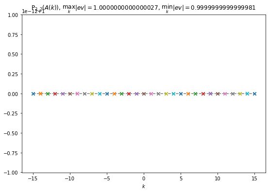
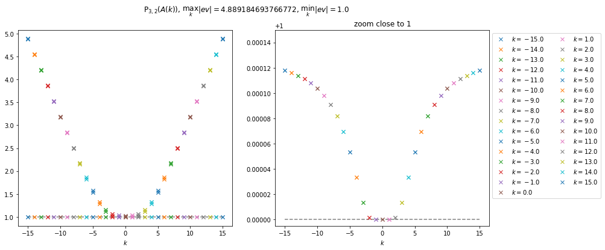
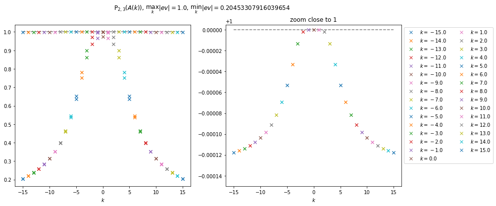
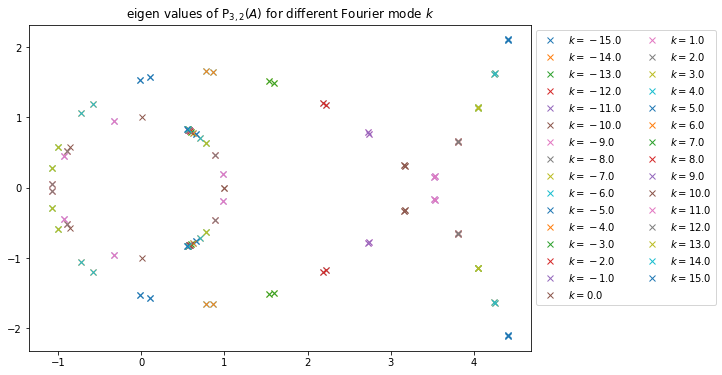
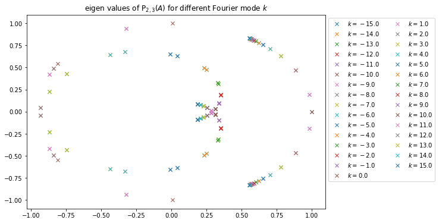

# 2021-04-21

## À propos des valeurs propres de Padé

On souhaite s'assurer de la stabilité d'une méthode Padé-Lawson-Runge-Kutta, pour cela il semble nécessaire que les valeurs propres de Padé soient de norme inférieure ou égale à 1, pour se retrouver dans un cas similaire à la stabilité d'une méthode de type Runge-Kutta.

On commence l'étude par un approximant de Padé (2,2).

Numériquement dans ce cas, toutes les valeurs propres sont de module 1 (l'échelle est en $10^{-12}+1$), la monté en ordre dans l'approximant de Padé donne les mêmes résultats.

On remarque que si le numérateur est de degré plus élevé, l'approximant de Padé toutes les valeurs propres sont de module supérieur à 1 (la figure de droite n'est qu'un zoom proche de 1 pour observer le comportement de la ligne de valeurs propres visible à gauche). Cela implique l'instabilité d'une méthode induite par l'approximant de Padé $\mathrm{P}_{3,2}$, et on peut, sans problème généralisé pour tout $n$ et $m$ tels que $n>m$.

Dans le cas de l'approximant de Padé $\mathrm{P}_{2,3}(A(k))$, les valeurs propres de l'approximant de Padé sont toutes de module inférieur à 1, ce qui laisse sous-entendre la stabilité de la méthode de Lawson induite par cet approximant. On peut très certainement généralisé pour tout $n$ et $m$ tels que $m>n$.

Et parce que les figures sont jolies on peut aussi regarder la disposition des valeurs propres.

  

  

  Valeurs prorpres de $\mathrm{P}_{3,2}(A(k))$ (à gauche) et $\mathrm{P}_{2,3}(A(k))$ (à droite).

