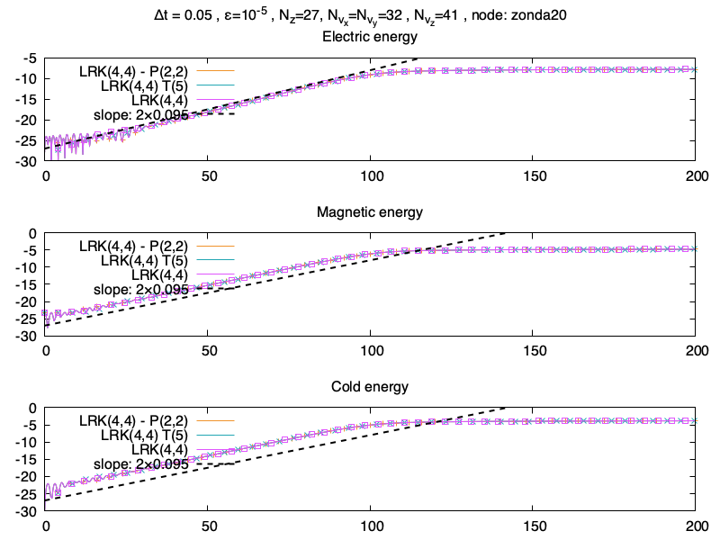
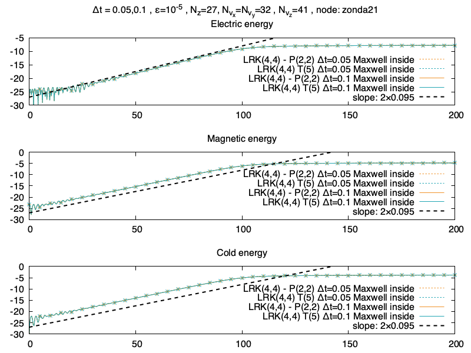
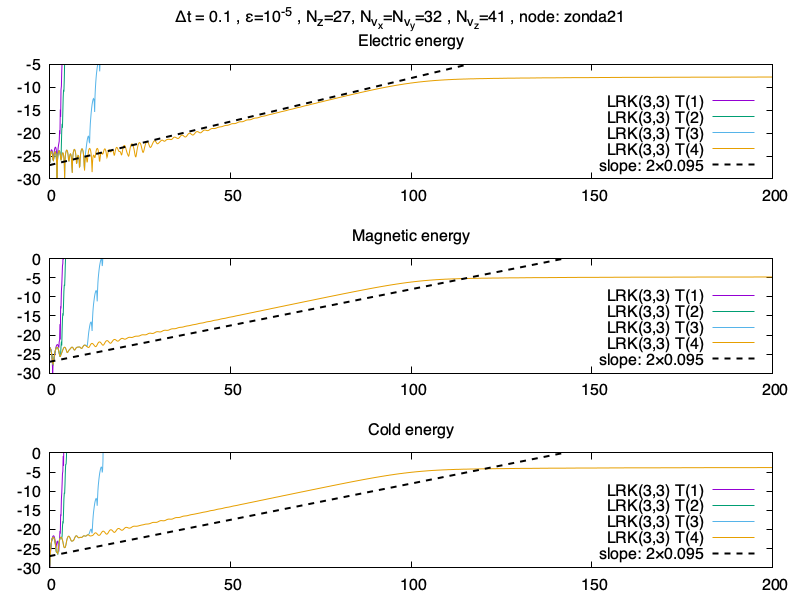
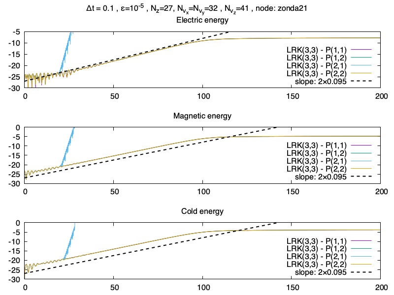
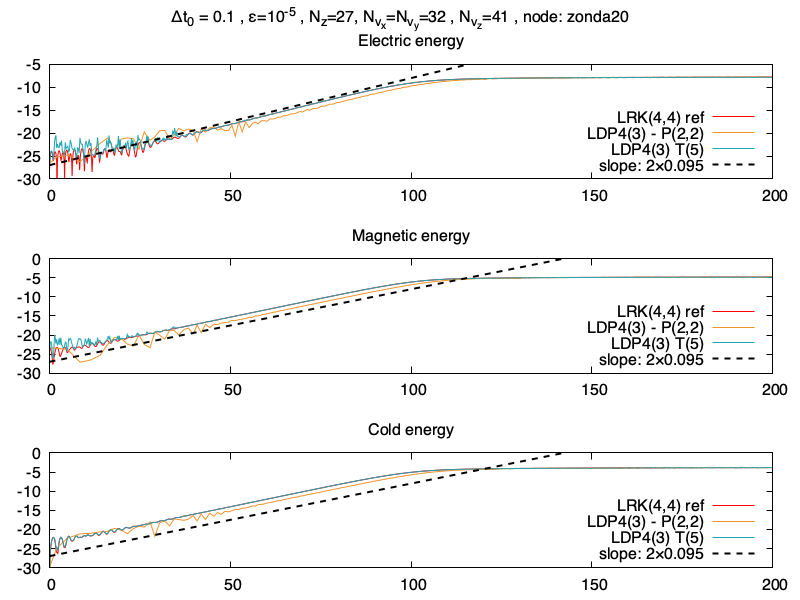
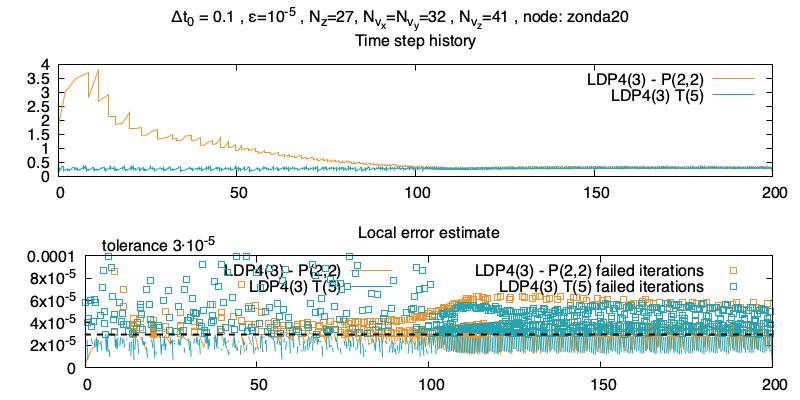
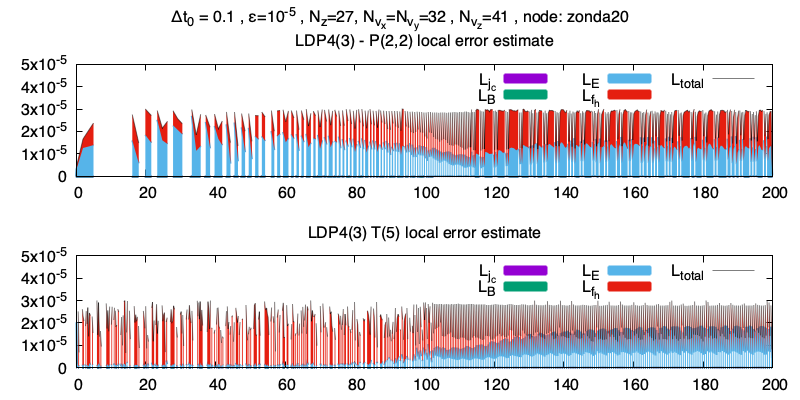
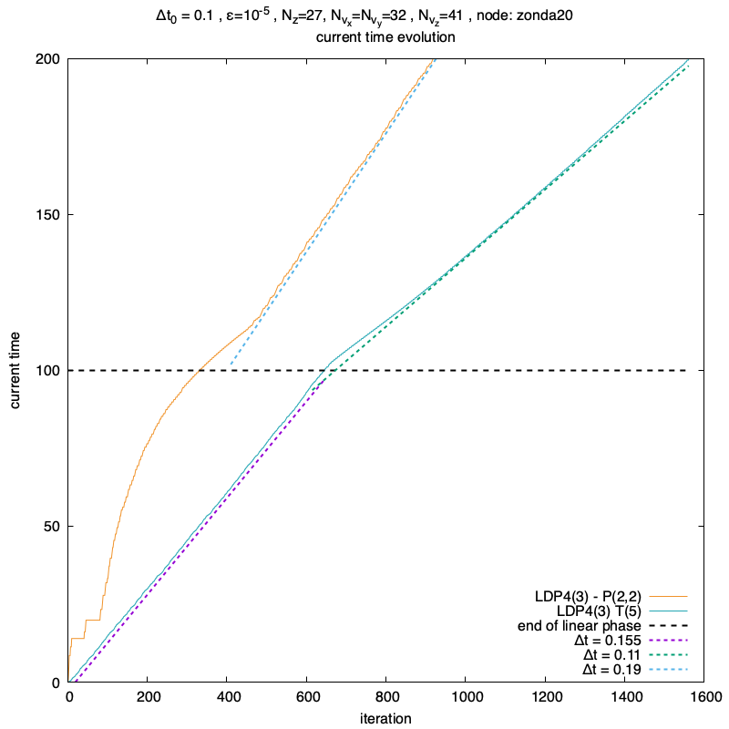

# 2021-07-09

## Résultats Lawson approximé par Taylor ou Padé

> Je fais ça rapidement, histoire de discuter des résultats numériques pour savoir ce que je garde vraiment ou non. À savoir que précédemment on a déjà illustré que les valeurs propres de la troncature de la série de Taylor ne sont (*pas du tout*) sur le cercle unité, alors que c'est le cas pour l'apporixmant de Padé. Cela fait dire à Nicolas qu'il faut tout bonnement le virer des résultats numérique, je trouve qu'il donne de meilleurs résultats qu'attendu (surtout lorsqu'on regarde les valeurs propres de $T_5(A)$).

> Je n'ai pas cherché à avoir de jolies explosions avec une rotation (même code que pour obtenir l'ordre des Lawson-Padé-Taylor mais en mode rotation). En effet ce code engendre des modes élevés (car multiplié par la vitesse qui dépend des bornes du domaine) et il est possible de faire exploser Taylor sans faire exploser Padé. Piste à creuser peut-être.

### Vérification

Premier lot de runs, on utilise la même partie linéaire que dans le papier (donc les équations de Maxwell ne sont pas dans la partie linéaire). Il s'agit juste de vérifier la possibilité de la méthode.

> Pour le moment rien de passionant, on cherche juste à vérifier que l'on peut approcher l'exponentielle de la partie linéaire sans encore en profiter (une *proof of concept*).

### Recherche d'un plus grand $\Delta t$

Maintenant on met les équations de Maxwell dans la partie linéaire, on regarde si on peut prendre des pas de temps plus grand (des tests précédent m'ont fait remarquer que $\Delta t=0.5$ était un peu trop grand, on le confirmera après avec le pas de temps adaptatif). On prend le même $\Delta t=0.05$ que dans le papier, et un pas de temps plus grand $\Delta t=0.1$ qui devient intéressant.

> Run pas très passionant non plus, ça marche, c'est cool !

### Taylor

Exploration de différentes troncatures de la série de Taylor, de l'ordre 1 à 4, avec un RK(3,3). (Les runs précédent étaient avec un RK(4,4), il s'agit ici de faire des runs normalement plus rapide pour tester des trucs...)

On remarque que pour les Taylor d'ordre plus faible ça explose, je ne sais pas exactement pourquoi.

### Padé

Exploration de différents approximants de Padé, de l'ordre $(1,1)$ à $(2,2)$, et il n'y a que le Padé $(2,1)$ qui explose, ce qui s'explique parce que le numérateur a un degré supérieur au dénominateur.

### Dormand-Prince

On regarde maintenant avec la méthode DP4(3), entre Taylor et Padé. On regarde tout d'abord les énergies, Padé prend de très grands pas de temps en début de simulation, ce qui explique le *shift* dans les résultats (la *bonne* solution est celle donnée par Taylor).

On regarde Maintenant l'historique de la taille du pas de temps, et on remarque que la méthode de Padé est nettement plus intéressante. Je présume que c'est le fait que Taylor soit, en théorie, instable qui justifie qu'il n'essaie pas de prendre de grands pas de temps, et se restreint à peu près à la CFL de la partie non-linéaire. On peut aussi regarder l'erreur locale, comme dans le cas du papier on a beaucoup d'itérations rejettées (je n'ai pas encore regardé en détail combien).

On peut regarder la contribution de chaque erreur, j'ai rassembler les courants froids, les champs magnétiques et électriques pour ne pas voir 7 contributions. On remarque que l'erreur provient très largement de $E$ et de $f_h$, ce qui correspond à ce qui est résolu dans la partie non-linéaire. Les *blancs* sont dûs aux itérations rejettées ou d'autres problèmes (purement techniques) de mon fichier de sauvegarde.

Par curiosité j'ai aussi regardé l'évolution du temps courant au cours des itérations.

