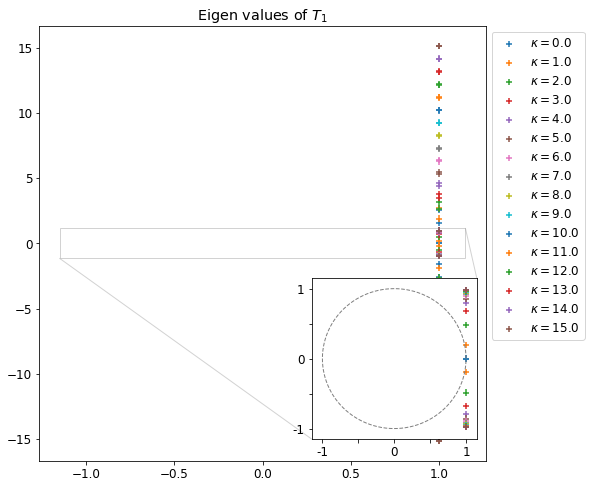
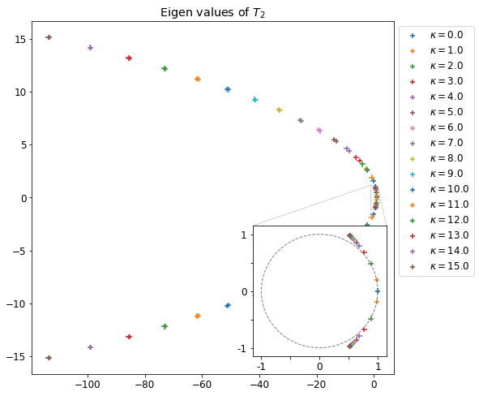
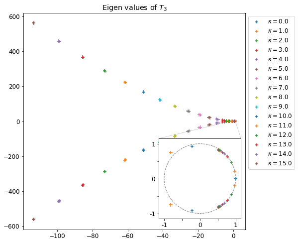
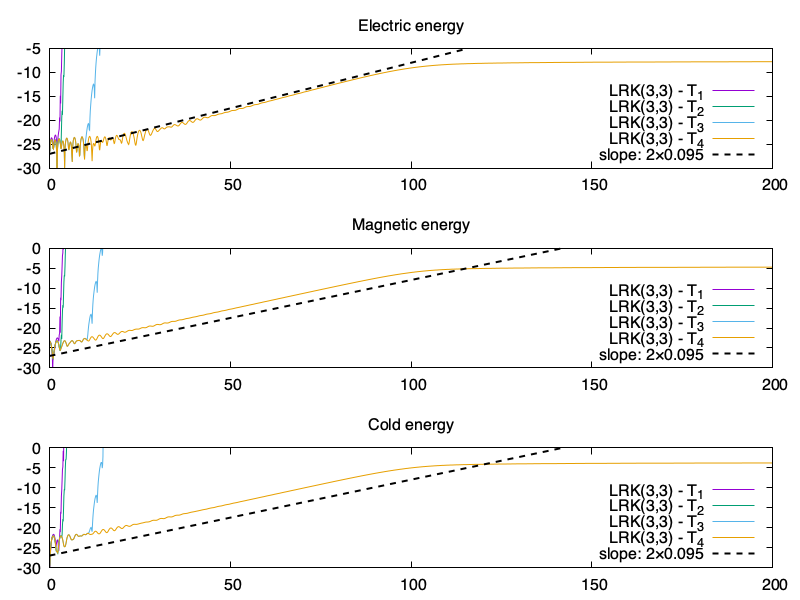
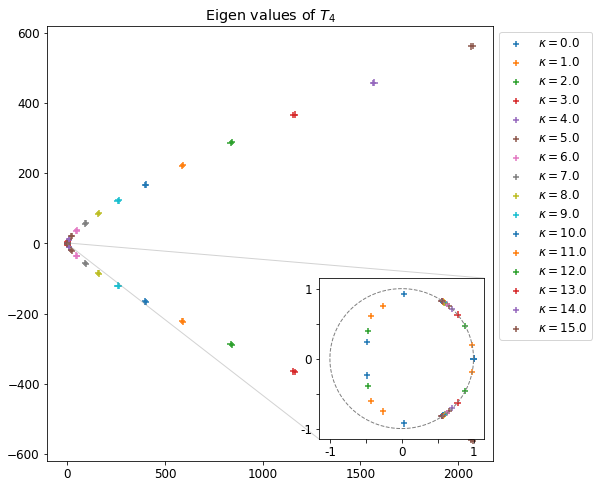
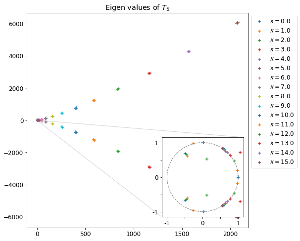
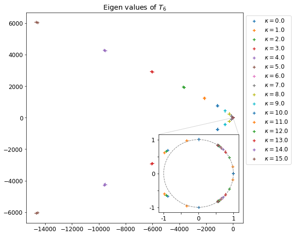

# 2021-07-29

## Valeurs propres de Taylor

On souhaite calculer une approximation de l'exponentielle de la partie linéaire $A$ de notre problème, où $A$ est définie par :
$$
  A = \begin{pmatrix}
    0 & -1 & 0       &  0       &  \Omega_{pe}^2  & 0             \\
    1 &  0 & 0       &  0       &  0              & \Omega_{pe}^2 \\
    0 &  0 & 0       &  0       &  0              & i\kappa       \\
    0 &  0 & 0       &  0       & -i\kappa        & 0             \\
   -1 &  0 & 0       & -i\kappa &  0              & 0             \\
    0 & -1 & i\kappa &  0       &  0              & 0             \\
  \end{pmatrix}
$$
avec les modes de Fourier $\kappa\in[\![-N_z,N_z]\!]$ et $N_z=15$, et $\Omega_{pe}=2$. On sait déjà que $A$ étant semblable à une matrice anti-hermitienne, ses valeurs propres sont imaginaires pures.

On approche $e^{M}$ par une troncature de la série de Taylor à l'ordre $m$ :
$$
  e^{M}\approx T_m(M) = \sum_{k=0}^{m}\frac{M^k}{k!}.
$$

Les valeurs propres de $A$ étant imaginaire pures, on sait que les valeurs propres de  $e^{tA}$ sont sur le cercle unité ($\forall t\in\mathbb{R}$).

Maintenant que tout est bien défini, regardons les valeurs propres de la troncature de la série de Taylor $T_m(A)$, avec $m=1,\dots,6$.

Pour $T_1(A)=I+A$, rien d'anormal puisque les valeurs propres de $A$ sont imaginaires pures et que $A$ est diagonalisable, on a :
$$
  I+A = P(I+D)P^{-1}
$$
où $P$ est la matrice de diagonalisation de $A$. On trouve bien que les valeurs propres de $I+A$ sont simplement translatées de 1.

Je n'y connais rien en géométrie et autres courbes quadratiques, mais ça me me semble pas étonnant de retrouver les valeurs propres $T_2(A)$ sur une parabole. On a aucune valeur propre dans le cercle unité pour Taylor 1 et 2.

Pour $T_3(A)$, on remarque que l'on a quelques valeurs propres (pour les modes les plus bas) dans le cercle unité, ce qui laisse présager d'une certaine stabilité du schéma de Lawson couplé à $T_3$, ce qui... n'est pas ce que je retrouvais dans mes résultats numériques, où l'on remarque que le schéma de Lawson LRK(3,3) couplé à $T_1$, $T_2$ et $T_3$ est instable. Après il y a assez peu de modes sur ou dans le cercle (en particulier le mode 2 (orange) qui risque d'être excité relativement tôt dans la simulation).

Pour $T_4$ on a toutes les valeurs propres des bas modes dans le cercle unité, cela semble justifier de sa stabilité numérique observée dans l'exemple précédent.

Un peu la même chose pour $T_5$, qui tourne sur de plus grosses simus (LRK(4,4) et avec un pas de temps plus grand que celui pris dans l'exemple précédent).

Et là, je pense que cela pourrait être intéressant d'ajouter une simu avec $T_6$ car on remarque que les valeurs propres ne sont pas dans le cercle unité (elles en sont pas loin, comme pour $T_2$ et $T_3$), il semble donc possible d'avoir un schéma instable avec une méthode d'ordre plus élevé. Cela donnerait sans doute un dernier coup fatal contre l'utilisation de Taylor, actuellement on ne comprend pas pourquoi $T_4$ et $T_5$ sont stables (on allume suffisamment peu de modes, et pour ces quelques modes on est stable ?), mais illustrer que c'est instable avec $T_6$ alors que l'on a une erreur de troncature plus faible me semble intéressant.

> Une autre solution pour faire exploser toutes les simu avec Taylor est de rafiner un peu en $z$ et utiliser une condition initiale excitée par un bain de modes. Sachant qu'on a pas besoin de capturer la pente, cela peut se faire avec un maillage grossier en vitesse.

